[资源：1234](https://pan.baidu.com/s/1tprakKWGrM6XR-Gy4V7-0g)

## 第四章 GPIO与流水灯

### 1. stm32系统架构

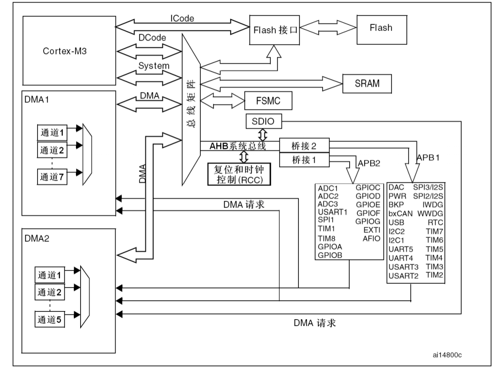

- 需要打开外设总线时钟才能使用对应外设
- APB1和APB2的最高时钟频率不同，APB1的最高时钟频率只能达到36MHz，APB2的时钟频率能达到最高主频72MHz

### 2. GPIO功能框图（输出部分）

  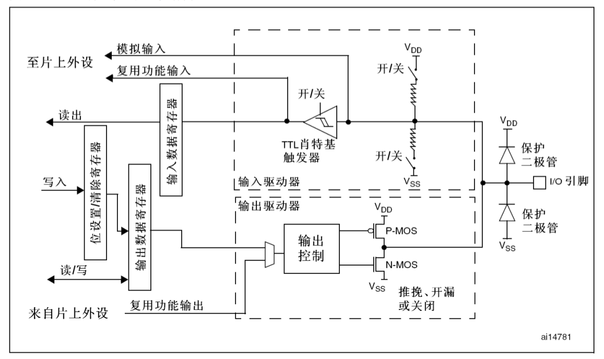

**GPIO（General Purpose Input Output， 通用输入输出端口）**被分为 **GPIOA ~ GPIOF** 共7组，而每组端口又分为0 ~ 15共计16个引脚。本芯片只有4组端口，而 **GPIOD** 只有3个引脚。

可以通过 **GPIO** 寄存器将stm32的 **GPIO** 配置为8种模式， 即4种输入模式和4种输出模式，分别是**浮空输入，上拉输入（Input Pull-up），下拉输入和模拟输入；开漏输出（Open-Drain，OD，一般配置一颗上拉电阻），推挽式输出（Push-Pull，PP），推挽式复用功能和开漏复用功能**。复位时默认**浮空输入模式**。配置外设 **GPIO** 的相应模式时，可查看参考手册的 **8.1.11**节。

- **开漏输出（Out_OD）**： 用于输出高低电平
- **推挽输出（Out_PP）**：用于输出低电平（常用）
- **复用开漏输出（AF_OD）**和**复用推挽输出（AF_PP）**

输入模式1种，输出模式对应3种输出速度3种，共需2位进行编码，还需要2个位对4种输入或输出方式进行编码，所以1个引脚总共需要4个位。而一个端口有16个引脚，需要64位8字节，对应2个32位的寄存器。

### 3. GPIO部分固件库函数

- **GPIO_WriteBit**：设置或清除指定的数据端口位
- **GPIO_Init**：根据 GPIO_InitStruct 中指定的参数初始化外设 GPIOx 寄存器
- **GPIO_ReadOutputDataBit**：读取指定端口管脚的输出

### 4. RCC部分寄存器和部分固件库函数

- **RCC_APB2PeriphClockCmd**：使能或者失能 APB2 外设时钟

配置示例：

```c
void ConfigGPIO(void)
{
  GPIO_InitTypeDef GPIO_InitStructure;      //用于存放GPOPIO参数
  
  RCC_APB2PeriphClockCmd(RCC_APB2Periph_GPIOC, ENABLE); //使能GPIOC时钟
  
  //PC4和PC5的初始化
  GPIO_InitStructure.GPIO_Pin = GPIO_Pin_4 | GPIO_Pin_5;
  GPIO_InitStructure.GPIO_Mode = GPIO_Mode_Out_PP;      //推挽输出
  GPIO_InitStructure.GPIO_Speed = GPIO_Speed_50MHz;
  GPIO_Init(GPIOC, &GPIO_InitStructure);
  //位写
  GPIO_WriteBit(GPIOC, GPIO_Pin_4, Bit_SET);
  GPIO_WriteBit(GPIOC, GPIO_Pin_5, Bit_RESET);
 
}
```

## 第五章 GPIO与独立按键输入

### 1. GPIO功能框图（输出部分）

**TTL斯密特触发器**：将模拟信号转化为数字信号 

- **浮空输入（IN_FLOATING）**：引脚的电平状态完全由外界电压决定
- **上拉输入（IPU）**：上拉电阻对应的开关处于关闭状态，默认处于高电平状态
- **下拉输入（IPD）**：下拉电阻对应的开关处于关闭状态，默认处于低电平状态
- **模拟输入（AIN）**：不会经过斯密特触发器

### 2. GPIO部分固件库函数

- **GPIO_ReadInputDataBit**：**读取**指定端口管脚的输入

### 3. 按键去抖原理

- 硬件去抖：电容
-  软件去抖：80ms内连续检测8次数

 ```c
 #define KEY_DOWN_LEVEL_KEY1 0x00				   //默认低电平状态
 #define KEY_DOWN_LEVEL_KEY2 0x00
 #define KEY_DOWN_LEVEL_KEY3 0x00
 
 static void ConfigKeyOneGPIO()
 {
   GPIO_InitTypeDef GPIO_InitStructure;        //GPIO_InitStructure用于存放GPIO的参数
   //使能RCC相关时钟
   RCC_APB2PeriphClockCmd(RCC_APB2Periph_GPIOA | RCC_APB2Periph_GPIOC, ENABLE);
   //配置PC1
   GPIO_InitStructure.GPIO_Mode = GPIO_Mode_IPU; //设置输入类型
   GPIO_InitStructure.GPIO_Pin = GPIO_Pin_1;     //设置引脚
   GPIO_Init(GPIOC, &GPIO_InitStructure);
   //配置PC1
   GPIO_InitStructure.GPIO_Mode = GPIO_Mode_IPU;
   GPIO_InitStructure.GPIO_Pin = GPIO_Pin_2;
   GPIO_Init(GPIOC, &GPIO_InitStructure);
   //配置PA0
   GPIO_InitStructure.GPIO_Pin = GPIO_Pin_0;
   GPIO_InitStructure.GPIO_Mode = GPIO_Mode_IPU;
   GPIO_Init(GPIOA, &GPIO_InitStructure);
 } 
 
 static u8 s_arrKeyDownLevel[KEY_NAME_MAX];   //按键按下时的电压，0x00为低电平，0xFF为高电平，需在InitKeyOne初始化
 
 void InitKeyOne(void)
 {
   ConfigKeyOneGPIO();                                          //配置按键的GPIO
   s_arrKeyDownLevel[KEY_NAME_KEY1] = KEY_DOWN_LEVEL_KEY1;      //按键按下时为低电平
   s_arrKeyDownLevel[KEY_NAME_KEY2] = KEY_DOWN_LEVEL_KEY2;
   s_arrKeyDownLevel[KEY_NAME_KEY3] = KEY_DOWN_LEVEL_KEY3;
 }
 
 #define KEY1 (GPIO_ReadInputDataBit(GPIOC, GPIO_Pin_1))    //读取对应按键引脚电平
 #define KEY2 (GPIO_ReadInputDataBit(GPIOC, GPIO_Pin_2))
 #define KEY3 (GPIO_ReadInputDataBit(GPIOA, GPIO_Pin_0))
 
 void ScanKeyOne(u8 keyName, void(*OnKeyOneUp)(void), void(*OnKeyOneDown)(void))  //消抖函数，每10ms调用一次，80ms位移循环一次
 {
   static u8 s_arrKeyVal[KEY_NAME_MAX];                          //定义个u8类型的数组，用于存放按键的数值
   static u8 s_arrKeyFlag[KEY_NAME_MAX];                         //定义一个u8类型的数组，用于存放按键的标志位
   
   s_arrKeyVal[keyName] <<= 1;                                   //左移一位
   
   switch(keyName)
   {
     case KEY_NAME_KEY1: s_arrKeyVal[keyName] |= KEY1; break;    //按下/松开时，KEY1为0/1
     case KEY_NAME_KEY2: s_arrKeyVal[keyName] |= KEY2; break;
     case KEY_NAME_KEY3: s_arrKeyVal[keyName] |= KEY3; break;
     default: break;
   }
   //按键标志位为TRUE时，判断按键是否有效按下
   if(s_arrKeyVal[keyName] == s_arrKeyDownLevel[keyName]/*0x00*/ && s_arrKeyFlag[keyName] == TRUE)
   {
     (*OnKeyOneDown)();                                          //执行按键按下的响应函数，在串口助手中打印信息
     s_arrKeyFlag[keyName] = FALSE;                              //表示按键处于按下状态，按键标志位的值更改为FALSE
   }
   else if(s_arrKeyVal[keyName] == (u8)(~s_arrKeyDownLevel[keyName]/*0xFF*/) && s_arrKeyFlag[keyName] == FALSE)
   {
     (*OnKeyOneUp)();
     s_arrKeyFlag[keyName] = TRUE;
   }
 }
 
 static  void  Proc2msTask(void)											//2ms执行一次的函数
 {  
   static i16 s_iCnt5 = 5;
   if(Get2msFlag())  //判断2ms标志状态
   {  
     if(s_iCnt5 >= 4)
     {
       ScanKeyOne(KEY_NAME_KEY1, ProcKeyUpKey1, ProcKeyDownKey1);
       ScanKeyOne(KEY_NAME_KEY2, ProcKeyUpKey2, ProcKeyDownKey2);
       ScanKeyOne(KEY_NAME_KEY3, ProcKeyUpKey3, ProcKeyDownKey3);   
       s_iCnt5 = 0;
     }
     else 
     {
       s_iCnt5++;
     }   
     Clr2msFlag();   //清除2ms标志
   }
 }
 ```

## 第六章 串口通信

### 1. UART功能框图

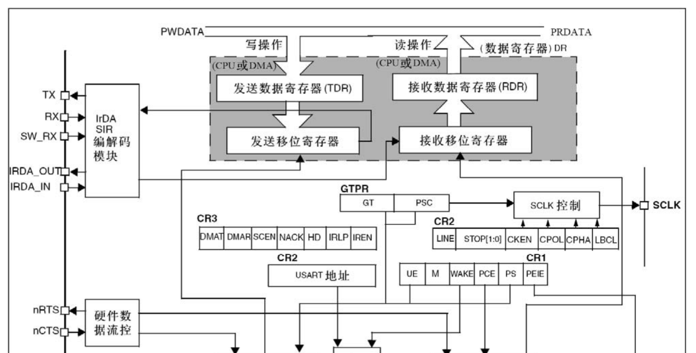

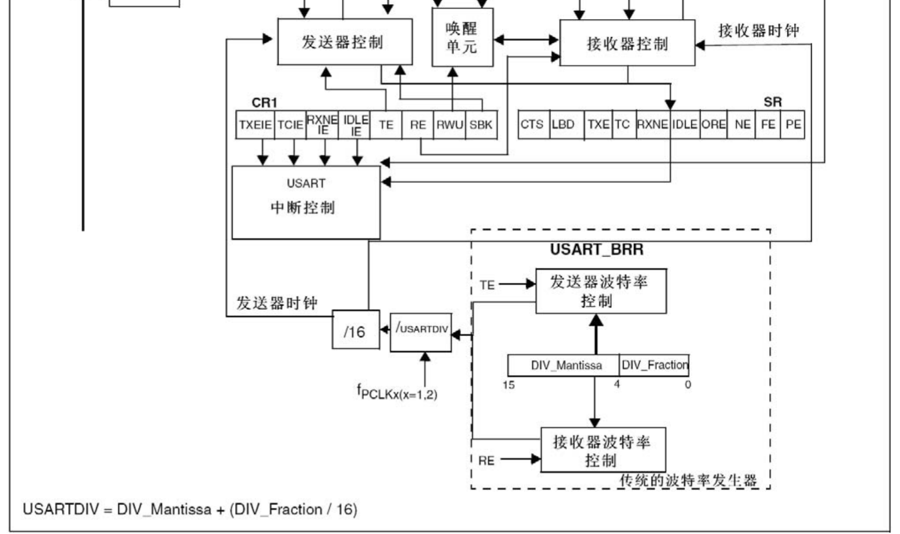

将数据写入寄存器时，写入的是**数据发送寄存器（TDR）**；从寄存器中接收数据时，是从**数据接收寄存器（RDR）**中接收。写入数据到**TDR**时，会由硬件将数据转移到**发送移位寄存器**，再由**TX**引脚一位一位地发送出去。接收数据时，由**RX**引脚一位一位地写入**接收移位寄存器**，然后由硬件将数据转移到**RDR**，读取**RDR**中的数据即可。

**发送器控制**： 控制数据的发送。发送数据之前，先将**CR1**中的**TE（Transmission Enable）**写入1使能发送，此时**发送移位寄存器**中的数据将会一位一位地通过**TX**引脚发送出去。当**发送位移寄存器**的最后一位发送完成时，如果**TDR**此时是空的，**SR**中的**TXE（Empty，表示发送数据寄存器空）**位就会被硬件置1， **TC（Transmission Complete）**也会被置1，表示发送完成。如果此时**CR1**的**TCIE（Interrupt Enable，中断使能控制器）**是1的话，就会产生中断。与**TXE**对应的是**TXEIE（发送数据寄存器空中断使能）**，当它被置1时，也会产生中断。**UART1**串口外设中的所有中断都是在同一个中断函数中执行的。**TXE**产生的中断用于防止数据覆盖。

**接收器控制**：**CR1**中的**RE（Receive Enable）**使能接收，接收完成后**SR**中的**RXNE（接收数据寄存器非空）**被硬件置1，当**CR1**中的**RXNEIE（接收数据寄存器非空中断使能）**为1时，会产生中断。

串口的波特率由专门的寄存器**（USART_BRR）**控制。

### 2. UART部分固件库函数

- **USART_Init**：根据**USART_InitStruct**中指定的参数初始化外设**USARTx**寄存器
- **USART_ Cmd**：使能或者失能**USART**外设
- **USART_ITConfig**：使能或者失能指定的**USART**中断
- **USART_ SendData**：通过外设**USARTx**发送单个数据
- **USART_ReceiveData**：返回**USARTx**最近接收到的数据
- **USART_ GetFlagStatus**：检查指定的**USART**标志位设置与否
- **USART_ ClearFlag**：清除**USARTx**的待处理标志位
- **USART_ GetITStatus**：检查指定的**USART**中断发生与否

### 3.  NVIC部分固件库函数

**NVIC**是功能强大的**中断控制器（Nested Vectored Interrupt Controller）**。

中断控制函数的声明可以在向量表中查看。

- **NVIC_Init**：根据**NVIC_InitStruct**中指定的参数初始化外设**NVIC**寄存器
- **NVIC_PriorityGroupConfig**：设置优先级分组：先占优先级和从优先级

### 4. UART1模块驱动设计

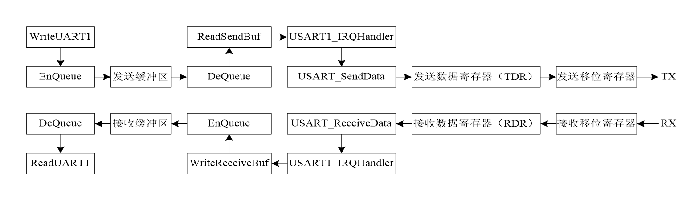

1. 配置软件触发串口发送并重定向printf函数：


```c
static void ConfigUART(u32 bound)
{
  GPIO_InitTypeDef  GPIO_InitStructure;   //GPIO_InitStructure用于存放GPIO的参数
  USART_InitTypeDef USART_InitStructure;  //USART_InitStructure用于存放USART的参数
  
  //使能RCC相关时钟                                                            
  RCC_APB2PeriphClockCmd(RCC_APB2Periph_USART1, ENABLE);  //使能USART1的时钟    
  RCC_APB2PeriphClockCmd(RCC_APB2Periph_GPIOA, ENABLE);   //使能GPIOA的时钟
  
  //配置TX的GPIO 
  GPIO_InitStructure.GPIO_Pin   = GPIO_Pin_9;               //设置TX的引脚
  GPIO_InitStructure.GPIO_Mode  = GPIO_Mode_AF_PP;          //设置TX的模式
  GPIO_InitStructure.GPIO_Speed = GPIO_Speed_50MHz;         //设置TX的I/O口输出速度
  GPIO_Init(GPIOA, &GPIO_InitStructure);                    //根据参数初始化TX的GPIO
  
  //配置RX的GPIO
  GPIO_InitStructure.GPIO_Pin   = GPIO_Pin_10;              //设置RX的引脚
  GPIO_InitStructure.GPIO_Mode  = GPIO_Mode_IN_FLOATING;    //设置RX的模式
  GPIO_Init(GPIOA, &GPIO_InitStructure);                    //根据参数初始化RX的GPIO
  
  //配置USART的参数
  USART_StructInit(&USART_InitStructure);                   //初始化USART_InitStructure
  USART_InitStructure.USART_BaudRate   = bound;             //设置波特率
  USART_InitStructure.USART_WordLength = USART_WordLength_8b;   //设置数据字长度
  USART_InitStructure.USART_StopBits   = USART_StopBits_1;  //设置停止位
  USART_InitStructure.USART_Parity     = USART_Parity_No;   //设置奇偶校验位
  USART_InitStructure.USART_Mode       = USART_Mode_Rx | USART_Mode_Tx;           //设置模式
  USART_InitStructure.USART_HardwareFlowControl = USART_HardwareFlowControl_None; //设置硬件流控制模式
  USART_Init(USART1, &USART_InitStructure);                 //根据参数初始化USART1

	USART_Cmd(USART1, ENABLE);                      //使能USART1                                                                
}

static void SendByte(u8 byte)											//采用查询的方式发送
{
	USART_SendData(USART1, byte);
	while(USART_GetFlagStatus(USART1, USART_FLAG_TXE) == RESET);
}

void SendString(char* str)
{
	while(*str != '\0')
	{
		SendByte(*str++);
	}
}

void InitUART1(u32 bound)
{
                  
  ConfigUART(bound);    			//配置串口相关的参数，包括GPIO、RCC、USART和NVIC  
}

int fputc(int ch, FILE* f)		//重定向
{
  SendByte((u8)ch);                    
  return ch;                  //返回ch
}
```


2. 配置串口DMA接收和发送：
STM32的 **IDLE** 中断（串口总线空中断）在串口无数据接收的情况下，是不会一直产生的，产生的条件是：当清除 **IDLE** 标志位后，必须有接收到第一个数据后，才开始触发，一旦接收的数据断流，没有接收到数据，即产生 **IDLE** 中断。**IDLE** 位不会再次被置高直到 **RXNE** 位被置起（即又检测到一次空闲总线）。**RXNE** 接收中断可以不用开启，减少进中断的次数。

```c
//DMA发送完善，接收并不完善
#define BufferSize 128

u8 TxBuffer[BufferSize] = "hello world\r\n";
u8 RxBuffer[BufferSize];

static void ConfigUART(u32 bound)
{
  GPIO_InitTypeDef  GPIO_InitStructure;   
  USART_InitTypeDef USART_InitStructure;  
	NVIC_InitTypeDef NVIC_InitStructure;											//用于串口接收总线空闲中断
  
  //使能RCC相关时钟                                                            
  RCC_APB2PeriphClockCmd(RCC_APB2Periph_USART1, ENABLE);   
  RCC_APB2PeriphClockCmd(RCC_APB2Periph_GPIOA, ENABLE);   
  
  //配置TX的GPIO 
  GPIO_InitStructure.GPIO_Pin   = GPIO_Pin_9;               //设置TX的引脚
  GPIO_InitStructure.GPIO_Mode  = GPIO_Mode_AF_PP;          
  GPIO_InitStructure.GPIO_Speed = GPIO_Speed_50MHz;         
  GPIO_Init(GPIOA, &GPIO_InitStructure);                   
  
  //配置RX的GPIO
  GPIO_InitStructure.GPIO_Pin   = GPIO_Pin_10;              //设置RX的引脚
  GPIO_InitStructure.GPIO_Mode  = GPIO_Mode_IN_FLOATING;    
  GPIO_Init(GPIOA, &GPIO_InitStructure);                    
  
  //配置USART的参数
  USART_StructInit(&USART_InitStructure);                   
  USART_InitStructure.USART_BaudRate   = bound;             
  USART_InitStructure.USART_WordLength = USART_WordLength_8b;   
  USART_InitStructure.USART_StopBits   = USART_StopBits_1;  
  USART_InitStructure.USART_Parity     = USART_Parity_No;  
  USART_InitStructure.USART_Mode       = USART_Mode_Rx | USART_Mode_Tx;           //设置接收和发送模式
  USART_InitStructure.USART_HardwareFlowControl = USART_HardwareFlowControl_None; //无硬件流控制
  USART_Init(USART1, &USART_InitStructure);                

	//配置中断
	NVIC_InitStructure.NVIC_IRQChannel = USART1_IRQn;
	NVIC_InitStructure.NVIC_IRQChannelCmd = ENABLE;
	NVIC_InitStructure.NVIC_IRQChannelPreemptionPriority = 2;
	NVIC_InitStructure.NVIC_IRQChannelSubPriority = 2;
	NVIC_Init(&NVIC_InitStructure);
	
	USART_ITConfig(USART1, USART_IT_IDLE, ENABLE);					//串口接收总线空闲空闲中断
	
	USART_DMACmd(USART1, USART_DMAReq_Tx, ENABLE);					//使能DMA发送
	USART_DMACmd(USART1, USART_DMAReq_Rx, ENABLE);					//使能DMA接收

	USART_Cmd(USART1, ENABLE);                      				//使能USART1                                                         
}
static void ConfigDMAForTx(void)
{
	//DMA CH4 -> USART1 Tx
	DMA_InitTypeDef DMA_InitStructure;
	
	RCC_AHBPeriphClockCmd(RCC_AHBPeriph_DMA1, ENABLE);
	
	DMA_DeInit(DMA1_Channel4);
	DMA_InitStructure.DMA_PeripheralBaseAddr = (uint32_t)&(USART1->DR); 		//外设地址
	DMA_InitStructure.DMA_MemoryBaseAddr 		 = (uint32_t)TxBuffer;					//存储器地址
	DMA_InitStructure.DMA_DIR 							 = DMA_DIR_PeripheralDST;       //外设作为目的地
	DMA_InitStructure.DMA_BufferSize         = BufferSize;												//传输数据量
	DMA_InitStructure.DMA_PeripheralInc      = DMA_PeripheralInc_Disable;   //外设地址不递增
	DMA_InitStructure.DMA_MemoryInc          = DMA_MemoryInc_Enable;				//存储器地址递增
	DMA_InitStructure.DMA_PeripheralDataSize = DMA_PeripheralDataSize_Byte; //外设以字节传输
	DMA_InitStructure.DMA_MemoryDataSize     = DMA_MemoryDataSize_Byte;			//存储器以字节传输
	DMA_InitStructure.DMA_Mode               = DMA_Mode_Normal; 						//单次模式
	DMA_InitStructure.DMA_Priority           = DMA_Priority_High;				//优先级高
	DMA_InitStructure.DMA_M2M                = DMA_M2M_Disable;
	DMA_Init(DMA1_Channel4, &DMA_InitStructure);
	
	DMA_Cmd(DMA1_Channel4, DISABLE);
}

static void ConfigDMAForRx(void)
{
	//DMA CH5 -> USART1 Rx
	DMA_InitTypeDef DMA_InitStructure;
	
	RCC_AHBPeriphClockCmd(RCC_AHBPeriph_DMA1, ENABLE);
	
	DMA_DeInit(DMA1_Channel5);
	DMA_InitStructure.DMA_PeripheralBaseAddr = (uint32_t)&(USART1->DR); 		//外设地址
	DMA_InitStructure.DMA_MemoryBaseAddr     = (uint32_t)RxBuffer;					//存储器地址
	DMA_InitStructure.DMA_DIR                = DMA_DIR_PeripheralSRC;       //存储器作为目的地
	DMA_InitStructure.DMA_BufferSize         = BufferSize;									//传输数据量
	DMA_InitStructure.DMA_PeripheralInc      = DMA_PeripheralInc_Disable;   //外设地址不递增
	DMA_InitStructure.DMA_MemoryInc          = DMA_MemoryInc_Enable;				//存储器地址递增
	DMA_InitStructure.DMA_PeripheralDataSize = DMA_PeripheralDataSize_Byte;
	DMA_InitStructure.DMA_MemoryDataSize     = DMA_MemoryDataSize_Byte;
	DMA_InitStructure.DMA_Mode               = DMA_Mode_Circular; 					//循环模式
	DMA_InitStructure.DMA_Priority           = DMA_Priority_VeryHigh;
	DMA_InitStructure.DMA_M2M                = DMA_M2M_Disable;
	DMA_Init(DMA1_Channel5, &DMA_InitStructure);
	
	DMA_Cmd(DMA1_Channel5, ENABLE);
}

void USART1_IRQHandler(void)
{
	//主要是处理串口总线空闲中断（接收）
	//
	
	u32 rec_len = 0;
	
	if(USART_GetITStatus(USART1, USART_IT_IDLE) == SET)
	{
		//防止后面的数据到来产生干扰
		DMA_Cmd(DMA1_Channel5, DISABLE);									
		
		//计算接收数据长度
		rec_len = BufferSize - DMA1_Channel5->CNDTR;
		DMA_SetCurrDataCounter(DMA1_Channel5, BufferSize);
		
		//将接收数组复制到发送数组
		memcpy(TxBuffer + 2, RxBuffer, BufferSize - 2);
		TxBuffer[0] = rec_len + '0';
		RxBuffer[1] = ' ';
		

		DMA_Cmd(DMA1_Channel5, ENABLE);
		
		//读一次数据，防止一直进中断
		USART_ReceiveData(USART1);
		USART_ClearFlag(USART1, USART_IT_IDLE);
	}
}


void InitUART1(u32 bound)
{    
	ConfigDMAForRx();
	ConfigDMAForTx();
  ConfigUART(bound);    			//配置串口相关的参数，包括GPIO、RCC、USART和NVIC  
}

void USART1_DMA_TXD(void)			//发送数据
{
	DMA_Cmd(DMA1_Channel4, DISABLE);
	
	DMA_SetCurrDataCounter(DMA1_Channel4, BufferSize);  //重新设置传输大小，即缓冲区的大小
	
	DMA_Cmd(DMA1_Channel4, ENABLE);
	
	while(DMA_GetFlagStatus(DMA1_FLAG_TC4) == RESET)
	{
	
	}
	
	//memset(TxBuffer, 0x00, BufferSize);							 //清空发送缓冲区
	
	DMA_ClearFlag(DMA1_FLAG_TC4);											 //清除传输完成标志位
}
```

## 第七章 定时器

### 1. 通用定时器框图

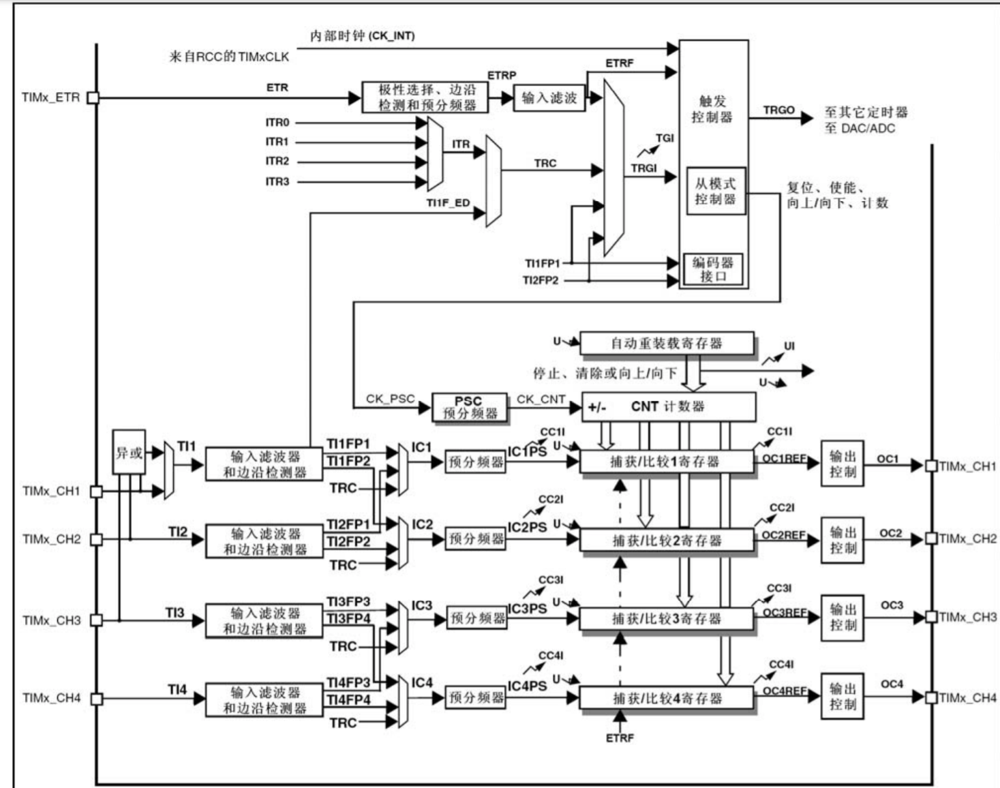

每个定时器有四个独立通道**（TIMx_CH1~4）**，这些通道可以用来作为：

- 输入捕获
- 输出比较
- **PWM**生成
- 单脉冲模式输出

相关寄存器：

- **计数器（TIMx_CNT）**：16位，0~65535计数
- **预分频器（TIMx_PSC）**：设置预分频，例如将72MHz时钟频率转化为1MHz
- **自动重装寄存器（TIMx_ARR）**：设置重装值，计数器计满后自动重装

### 2. 部分固件库函数

- **TIM_TimeBaseInit**：根据**TIM_TimeBaseInitStruct**中指定的参数初始化 TIMx 的时 间基数单位
- **TIM _ITConfig**：使能或者失能指定的**TIM**中断
- **TIM_Cmd**：使能或者失能**TIMx**外设，使用定时器时需要使能
- **TIM_ GetITStatus**：检查指定的 TIM 中断发生与否
- **TIM_ ClearITPendingBit**：清除 TIMx 的中断待处理位

最后两个函数通常在中断服务函数中使用：

```c
void ConfigTIMGPIO(u32 arr, u32 psc)
{
  TIM_TimeBaseInitTypeDef TIM_TimeBaseInitStructure;
  NVIC_InitTypeDef NVIC_InitStructure;
  
  RCC_APB1PeriphClockCmd(RCC_APB1Periph_TIM3, ENABLE);
  //TIM3
  TIM_TimeBaseInitStructure.TIM_ClockDivision = TIM_CKD_DIV1;             //时钟分割：不分割
  TIM_TimeBaseInitStructure.TIM_CounterMode = TIM_CounterMode_Up;         //计数方式：向上计数
  TIM_TimeBaseInitStructure.TIM_Period = arr;                             //自动重装值
  TIM_TimeBaseInitStructure.TIM_Prescaler = psc;                          //预分频系数
  TIM_TimeBaseInit(TIM3, &TIM_TimeBaseInitStructure);
  //使能TIM3并使能定时器更新中断
  TIM_Cmd(TIM3, ENABLE);
  TIM_ITConfig(TIM3, TIM_IT_Update, ENABLE);
  //NVIC
  NVIC_InitStructure.NVIC_IRQChannel = TIM3_IRQn;                         //中断通道号
  NVIC_InitStructure.NVIC_IRQChannelCmd = ENABLE;
  NVIC_InitStructure.NVIC_IRQChannelPreemptionPriority = 1;
  NVIC_InitStructure.NVIC_IRQChannelSubPriority = 1;
  NVIC_Init(&NVIC_InitStructure);
}
static u32 s_i1secFlag = FALSE;                       //1s标志

void TIM3_IRQHandler(void)  
{
  static  u16 s_iCnt1000  = 0;                        //定义一个静态变量s_iCnt1000作为1sec计数器
  
  if (TIM_GetITStatus(TIM3, TIM_IT_Update) == SET)    //检查到TIM3更新中断的发生
  {
    TIM_ClearITPendingBit(TIM3, TIM_FLAG_Update);     //清除TIM3更新中断标志 
  }
  s_iCnt1000++;                                       //1000ms计数器的计数值大于或等于2
  if(s_iCnt1000 >= 1000)                              //1000ms计数器的计数值超过1000
  {
    s_iCnt1000 = 0;                                   //重置1000ms计数器的计数值为0
    s_i1secFlag = TRUE;                               //将1s标志设置为TRUE
  }
}
int main(void)
{ 
  ConfigTIMGPIO(999, 71);
  //时钟频率 f = F / (psc + 1) = 1 MHz, 其中 F = 72MHz, T = 1 / f = 1us
  //中断周期 t = T * (arr + 1) = 1ms
}
```

## 第八章  SysTick

SysTick功能框图：

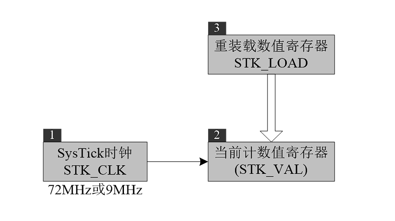

相关寄存器：

- **STK_LOAD**：重装数值寄存器
- **STK_VAL**：当前计数值寄存器
- **STK_CLK**：SysTick时钟，9MHz或72MHz，只能向下计数 

相关固件库函数：

- **SysTick_Config**：SysTick_Config(SystemCoreClock / 1000)，每1ms产生一次中断

## 第九章 RCC

### 1. RCC功能框图

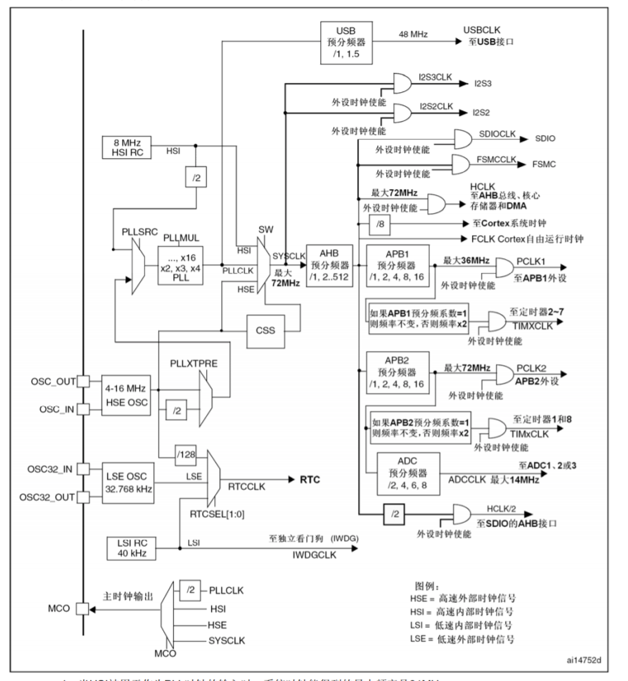

**复位和时钟控制模块（简称RCC，Reset and Clock Control)**包含**外部高速时钟HSE**、**锁相环时钟选择器和倍频器PLL**、**系统时钟SYSCLK选择器**、**AHB预分频器**、**APB1和APB2预分频器**、**定时器倍频器**、**ADC预分频器**和**Cortex系统时钟分频器**。

1. **高速外部时钟HSE**：
   **HSE**是高速外部时钟的缩写，**HSE**可以由有源晶振提供，也可以由无源晶振提供，范围为4~16MHz。STM32 核心板板载晶振为无源8MHz晶振，通过**OSC_IN**和**OSC_OUT**两个引脚接入芯片，同时还要配谐振电容。如果选择有源晶振，则时钟从**OSC_IN**接入，**OSC_OUT**悬空。

2. **锁相环时钟选择器和倍频器**：
   锁相环时钟**PLLCLK**由两级选择器和一级倍频器组成。第一级锁相环时钟选择器通过**RCC_CFGR**的**PLLXTPRE**选择**HSE二分频**或**HSE**作为下一级的时钟输入，第二级锁相环选择器通过**RCC_CFGR**的**PLLSRC**选择**HSE（或HSE 二分频）**或**HSI二分频（4MH）**作为下一级的时钟输入。本书所有实验均选择**HSE（8MHz）**作为下一级的时钟输入。**HSI**是内部高速时钟的缩写，由内部**RC**振荡器产生，频率为 8MHz，但不稳定。锁相环时钟倍频器通过**RCC_CFGR**的**PLLMUL**选择对上一级时钟进行2、3、4、16倍输出，由于本书所有实验中**PLLMUL**均为0111，即配置为9倍频，因此，此处输时钟（**PLLCLK**）的频率为72MHz。

3. **系统时钟SYSCLK选择器**：
   通过**RCC_CFGR**的**SW**选择系统时钟**SYSCLK**的时钟源，可以选择**HSI**、**HSE**或**PLLCLK**作为**SYSCLK**的时钟源。本书所有实验均选择**PLLCLK**作为**SYSCLK**的时钟源，由于**PLLCLK**是72MHz，因此，**SYSCLK**同样也是72MHz。

4. **AHB预分频器**：
   **AHB**预分频器通过**RCC_CFGR**的**HPRE**对**SYSCLK** 进行1、2、4、8、16、64、128、256或512分频，本书所有实验的**AHB**预分频器均未对**SYSCLK**进行分频，即**AHB**时钟然为72MHz。
5. **APB1和APB2预分频器**：
   **AHB**时钟是**APB1**和**APB2**预分频器的时钟输入，**APB1**预分频器通过 **RCC_CFGR**的**PPRE1**对**AHB** 时钟进行1、2、4、8或16分频，APB2预分频器通过**RCC_CFGR**的**PPRE2**对**AHB**时钟进行1、2、4、8或16分频。本书所有实验的**APB1**预分频器均对**AHB**时钟行2分频，**APB2**预分频器对**AHB**时钟未进行分频，因此，**APB1**时钟频率为36MHz，**APB1**时钟频率为72MHz。需要注意的是，**APB1**时钟最大频率为36MHz，**APB2**时钟最大频率为72MHz。
6. **定时器倍频器**：
   STM32有8个定时器，其中**TIM2~7**时钟由**APB1**时钟提供,**TIM1**和**TIM8**时钟由**APB2**时钟提供。当**APBx**预分频器的分频系数为1时，定时器的时钟频率与**APBx**时钟频率相等；否则，当**APBx**预分频器的分频系数不为1时，定时器的时钟频率是**APBx**时钟频率的2倍。本书所有实验的**APB1**预分频器的分频系数均为2，**APB2**预分频器的分频系数为1，而且**APB1**时钟频率为36MHz，**APB2**时钟频率为72MHz因此**TIM2~7**的时钟频率为72MHz，**TIM1**和**TIM8**的时钟频率同样为72MHz。
7. **ADC预分频器**：
   STM32微控制器的**ADC**时钟由**APB2**时钟提供，**ADC**预分频器通过**RCC_CFGR**的**ADCPRE**对**APB2**时钟进行 2、4、6或8分频，由于**APB2** 时钟是72MHz，而本书最后两个实验（DAC实验和ADC实验）的**ADC**预分频器的分频因子为6，因此，最终的**ADC**时钟为72MHz / 6= 12MHz。

8. **Cortex系统时钟分频器**：
   **AHB**时钟或**AHB**时钟经过8分频，作为Cortex系统时钟。书中的**SysTick**实验使用的即为**Cortex**系统时钟，**AHB**时钟频率为72MHz，因此，**SysTick**时钟频率同样是72MHz，或是9MHz。本书所有实验的 **Cortex**系统时钟频率均默认为72MHz，因此，**SysTick**时钟频率也为72MHz。

### 2. 配置示例

```c
static void ConfigRCC()
{
  ErrorStatus HSEStartUpStatus;       //定义枚举变量，用来标志外部高速晶振的状态
  RCC_DeInit();                       //将外设RCC寄存器重设为默认值
  
  RCC_HSEConfig(RCC_HSE_ON);          //使能外部高速晶振
  
  HSEStartUpStatus = RCC_WaitForHSEStartUp();   //等待外部高速晶振稳定
  
  if(HSEStartUpStatus == SUCCESS)               //外部高速晶振成功稳定
  {
    FLASH_PrefetchBufferCmd(FLASH_PrefetchBuffer_Enable);//使能Flash预读缓冲区
    
    FLASH_SetLatency(FLASH_Latency_2);          //设置代码延时值，2延时周期
    
    RCC_HCLKConfig(RCC_SYSCLK_Div1);            //设置高速AHB时钟（HCLK），HCLK = SYSCLK
    
    RCC_PCLK2Config(RCC_HCLK_Div1);             //设置高速APB2时钟（PCLK2），PCLK2 = HCLK
    
    RCC_PCLK1Config(RCC_HCLK_Div2);             //设置高速APB2时钟（PCLK1），PCLK1 = HCLK / 2
    
    RCC_PLLConfig(RCC_PLLSource_HSE_Div1, RCC_PLLMul_9); //设置PLL时钟源及倍频系数，PLLCLK = 8MHz * 9 = 72MHz
    
    RCC_PLLCmd(ENABLE);                         //使能PLL
    
    while(RCC_GetFlagStatus(RCC_FLAG_PLLRDY) == RESET)   //等待锁相环输出稳定
    {
      
    }
    RCC_SYSCLKConfig(RCC_SYSCLKSource_PLLCLK);  //将锁相环输出设置为系统时钟
      
    while(RCC_GetSYSCLKSource() != 0x08)        //等待PLL成功用于系统时钟的时钟源
    {
    
    }
  }
}
```

## 第十章 外部中断

### 1. 外部中断/事件控制器框图

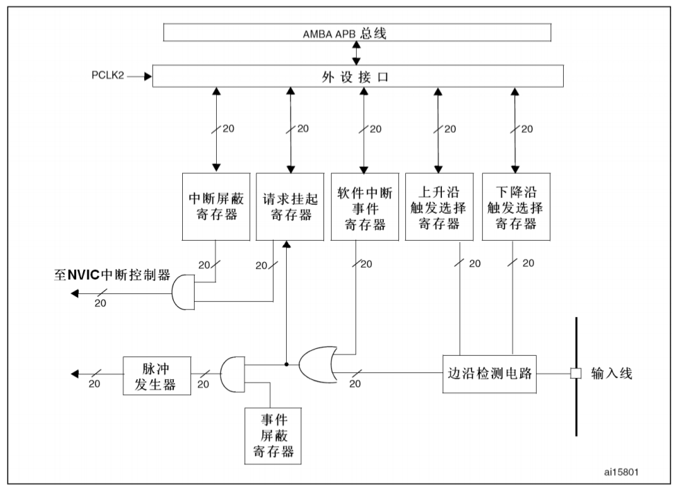

1. **EXTI输入线**：stm32的**EXTI**输入线有20个，即 **EXTI0\~EXTI19** 。其中 **EXTI0\~EXTI15** 用于**GPIO**，每个**GPIO**都可作为 **EXTI** 的输入源。
2. **边沿检测电路**：通过配置上升沿触发选择寄存器（**EXTI_RTSR**）和下降沿触发选择寄存器（**EXTI_FTSR**），可实现输入信号的上升沿检测、下降沿检测和同时检测。
3. **软件中断**：软件中断事件寄存器（**EXTI_SWIER**）的输出和边沿检测电路的输出通过或运算输出到下一级。
4. **中断请求挂起**：当某 **EXTI** 输入线检测到已经配置好的边沿事件时，请求挂起寄存器（**EXTI_PR**）的对应位将会被置1。向该位写1可以清除它，也可以通过改变边沿检测的极性清除它。
5. **中断输出**：**EXTI** 的最后一个环节是中断输出，可以是中断输出，也可以是事件输出。中断需要CPU参与，事件不需要CPU参与。请求挂起寄存器（**EXTI_PR**）的输出与中断屏蔽寄存器（**EXTI_IMR**）的输出经过与运算输出到 **NVIC** 中断控制器。

部分固件库函数：

- **EXTI_Init**：根据结构体参数初始化外设EXTI寄存器
- **EXTI_GetITStatus**：检测指定的EXTI线路发生与否
- **EXTI_ClearITPendingBit**：清除EXTI中断挂起
- **GPIO_EXTILineConfig**：选择GPIO引脚作为外部中断线路

### 2. 配置示例

```c
//配置Key1(PC1)控制LED1(PC4)的亮灭
void ConfigLEDGPIO()//PC4
{
  GPIO_InitTypeDef GPIO_InitStructure;
  RCC_APB2PeriphClockCmd(RCC_APB2Periph_GPIOC, ENABLE);
  
  GPIO_InitStructure.GPIO_Pin = GPIO_Pin_4;
  GPIO_InitStructure.GPIO_Mode = GPIO_Mode_Out_PP;      //推挽输出
  GPIO_InitStructure.GPIO_Speed = GPIO_Speed_50MHz;
  GPIO_Init(GPIOC, &GPIO_InitStructure);
  
  GPIO_SetBits(GPIOC, GPIO_Pin_4);                      //初始亮
}
void ConfigKEY1ForEXTI(void)//KEY1:PC1 AFIO -> EXTI -> NVIC
{
  GPIO_InitTypeDef GPIO_InitStructure;
  EXTI_InitTypeDef EXTI_InitStructure;
  NVIC_InitTypeDef NVIC_InitStructure;
  
  RCC_APB2PeriphClockCmd(RCC_APB2Periph_GPIOC, ENABLE);
  
  RCC_APB2PeriphClockCmd(RCC_APB2Periph_AFIO, ENABLE);       //需要打开复用功能

  //PC1
  GPIO_InitStructure.GPIO_Pin = GPIO_Pin_1;
  GPIO_InitStructure.GPIO_Mode = GPIO_Mode_IN_FLOATING;      //浮空输入
  GPIO_Init(GPIOC, &GPIO_InitStructure);
  
  GPIO_EXTILineConfig(GPIO_PortSourceGPIOC, GPIO_PinSource1);//选择某一引脚作为外部中断线路
  
  //EXTI
  EXTI_InitStructure.EXTI_Line = EXTI_Line1;                 //线路1对应引脚1
  EXTI_InitStructure.EXTI_LineCmd = ENABLE;
  EXTI_InitStructure.EXTI_Mode = EXTI_Mode_Interrupt;        //中断
  EXTI_InitStructure.EXTI_Trigger = EXTI_Trigger_Falling;    //下降沿触发
  EXTI_Init(&EXTI_InitStructure);
  
  //NVIC
  NVIC_InitStructure.NVIC_IRQChannel = EXTI1_IRQn;
  NVIC_InitStructure.NVIC_IRQChannelCmd = ENABLE;
  NVIC_InitStructure.NVIC_IRQChannelPreemptionPriority = 2;
  NVIC_InitStructure.NVIC_IRQChannelSubPriority = 2;
  NVIC_Init(&NVIC_InitStructure);
}
void EXTI1_IRQHandler(void)
{
  if(EXTI_GetITStatus(EXTI_Line1) == SET)                    //判断中断是否发生
  {
    GPIO_WriteBit(GPIOC, GPIO_Pin_4, (BitAction)(1 - GPIO_ReadOutputDataBit(GPIOC, GPIO_Pin_4)));
    EXTI_ClearITPendingBit(EXTI_Line1);                      //清除中断标志
  }
}
```

## 第十一章 OLED显示

**OLEDRefreshGRAM()**函数在每1s执行任务中执行。

- **OLED.c**

```c
#include "OLED.h"
#include "stm32f10x_conf.h"
#include "OLEDFont.h"
#include "SysTick.h"

#define OLED_CMD    0 //命令
#define OLED_DATA   1 //数据

//OLED端口定义  
#define CLR_OLED_CS()   GPIO_ResetBits(GPIOB, GPIO_Pin_12)  //CS，片选
#define SET_OLED_CS()   GPIO_SetBits  (GPIOB, GPIO_Pin_12)

#define CLR_OLED_RES()  GPIO_ResetBits(GPIOB, GPIO_Pin_14)  //RES，复位
#define SET_OLED_RES()  GPIO_SetBits  (GPIOB, GPIO_Pin_14)

#define CLR_OLED_DC()   GPIO_ResetBits(GPIOC, GPIO_Pin_3)   //DC，命令数据标志（0-命令/1-数据）
#define SET_OLED_DC()   GPIO_SetBits  (GPIOC, GPIO_Pin_3)
 
#define CLR_OLED_SCK() GPIO_ResetBits(GPIOB, GPIO_Pin_13)   //SCK，时钟
#define SET_OLED_SCK() GPIO_SetBits  (GPIOB, GPIO_Pin_13)

#define CLR_OLED_DIN() GPIO_ResetBits(GPIOB, GPIO_Pin_15)   //DIN，数据
#define SET_OLED_DIN() GPIO_SetBits  (GPIOB, GPIO_Pin_15)

/*内部函数声明*/
static  u8  s_arrOLEDGRAM[128][8];    //OLED显存缓冲区

static  void  ConfigOLEDGPIO(void);             //配置OLED的GPIO
static  void  ConfigOLEDReg(void);              //配置OLED的SSD1306寄存器
                                                
static  void  OLEDWriteByte(u8 dat, u8 cmd);    //向SSD1306写入一个字节
static  void  OLEDDrawPoint(u8 x, u8 y, u8 t);  //在OLED屏指定位置画点
                                                
static  u32   CalcPow(u8 m, u8 n);              //计算m的n次方

/*内部函数定义*/
static  void  ConfigOLEDGPIO(void)
{
  GPIO_InitTypeDef  GPIO_InitStructure;
    
  //使能RCC相关时钟
  RCC_APB2PeriphClockCmd(RCC_APB2Periph_GPIOB, ENABLE); //使能GPIOB的时钟
  RCC_APB2PeriphClockCmd(RCC_APB2Periph_GPIOC, ENABLE); //使能GPIOC的时钟
  
  //配置PB13（OLED_SCK）
  GPIO_InitStructure.GPIO_Pin   = GPIO_Pin_13;          //设置引脚
  GPIO_InitStructure.GPIO_Mode  = GPIO_Mode_Out_PP;     //设置模式 
  GPIO_InitStructure.GPIO_Speed = GPIO_Speed_50MHz;     //设置I/O输出速度
  GPIO_Init(GPIOB, &GPIO_InitStructure);                //根据参数初始化GPIO
  GPIO_SetBits(GPIOB, GPIO_Pin_13);                     //设置初始状态为高电平

  //配置PB15（OLED_DIN）
  GPIO_InitStructure.GPIO_Pin   = GPIO_Pin_15;          //设置引脚
  GPIO_InitStructure.GPIO_Mode  = GPIO_Mode_Out_PP;     //设置模式  
  GPIO_InitStructure.GPIO_Speed = GPIO_Speed_50MHz;     //设置I/O输出速度
  GPIO_Init(GPIOB, &GPIO_InitStructure);                //根据参数初始化GPIO
  GPIO_SetBits(GPIOB, GPIO_Pin_15);                     //设置初始状态为高电平

  //配置PB14（OLED_RES）
  GPIO_InitStructure.GPIO_Pin   = GPIO_Pin_14;          //设置引脚
  GPIO_InitStructure.GPIO_Mode  = GPIO_Mode_Out_PP;     //设置模式  
  GPIO_InitStructure.GPIO_Speed = GPIO_Speed_50MHz;     //设置I/O输出速度
  GPIO_Init(GPIOB, &GPIO_InitStructure);                //根据参数初始化GPIO
  GPIO_SetBits(GPIOB, GPIO_Pin_14);                     //设置初始状态为高电平

  //配置PB12（OLED_CS）
  GPIO_InitStructure.GPIO_Pin   = GPIO_Pin_12;          //设置引脚
  GPIO_InitStructure.GPIO_Mode  = GPIO_Mode_Out_PP;     //设置模式  
  GPIO_InitStructure.GPIO_Speed = GPIO_Speed_50MHz;     //设置I/O输出速度
  GPIO_Init(GPIOB, &GPIO_InitStructure);                //根据参数初始化GPIO
  GPIO_SetBits(GPIOB, GPIO_Pin_12);                     //设置初始状态为高电平

  //配置PC3（OLED_DC）
  GPIO_InitStructure.GPIO_Pin   = GPIO_Pin_3;           //设置引脚
  GPIO_InitStructure.GPIO_Mode  = GPIO_Mode_Out_PP;     //设置模式  
  GPIO_InitStructure.GPIO_Speed = GPIO_Speed_50MHz;     //设置I/O输出速度
  GPIO_Init(GPIOC, &GPIO_InitStructure);                //根据参数初始化GPIO
  GPIO_SetBits(GPIOC, GPIO_Pin_3);                      //设置初始状态为高电平
}
static  void  ConfigOLEDReg(void)
{
  OLEDWriteByte(0xAE, OLED_CMD); //关闭显示
  
  OLEDWriteByte(0xD5, OLED_CMD); //设置时钟分频因子，振荡频率
  OLEDWriteByte(0x50, OLED_CMD); //[3:0]为分频因子，[7:4]为振荡频率
  
  OLEDWriteByte(0xA8, OLED_CMD); //设置驱动路数
  OLEDWriteByte(0x3F, OLED_CMD); //默认0x3F（1/64） 
  
  OLEDWriteByte(0xD3, OLED_CMD); //设置显示偏移
  OLEDWriteByte(0x00, OLED_CMD); //默认为0

  OLEDWriteByte(0x40, OLED_CMD); //设置显示开始行，[5:0]为行数
  
  OLEDWriteByte(0x8D, OLED_CMD); //设置电荷泵
  OLEDWriteByte(0x14, OLED_CMD); //bit2用于设置开启（1）/关闭（0）
  
  OLEDWriteByte(0x20, OLED_CMD); //设置内存地址模式
  OLEDWriteByte(0x02, OLED_CMD); //[1:0]，00-列地址模式，01-行地址模式，10-页地址模式（默认值）
  
  OLEDWriteByte(0xA1, OLED_CMD); //设置段重定义，bit0为0，列地址0->SEG0，bit0为1，列地址0->SEG127
  
  OLEDWriteByte(0xC0, OLED_CMD); //设置COM扫描方向，bit3为0，普通模式，bit3为1，重定义模式
  
  OLEDWriteByte(0xDA, OLED_CMD); //设置COM硬件引脚配置
  OLEDWriteByte(0x12, OLED_CMD); //[5:4]为硬件引脚配置信息
  
  OLEDWriteByte(0x81, OLED_CMD); //设置对比度
  OLEDWriteByte(255 / 2, OLED_CMD); //1～255，默认为0x7F（亮度设置，越大越亮）
  
  OLEDWriteByte(0xD9, OLED_CMD); //设置预充电周期
  OLEDWriteByte(0xf1, OLED_CMD); //[3:0]为PHASE1，[7:4]为PHASE2
  
  OLEDWriteByte(0xDB, OLED_CMD); //设置VCOMH电压倍率
  OLEDWriteByte(0x30, OLED_CMD); //[6:4]，000-0.65*vcc，001-0.77*vcc，011-0.83*vcc

  OLEDWriteByte(0xA4, OLED_CMD); //全局显示开启，bit0为1，开启，bit0为0，关闭
  
  OLEDWriteByte(0xA6, OLED_CMD); //设置显示方式，bit0为1，反相显示，bit0为0，正常显示 
  
  OLEDWriteByte(0xAF, OLED_CMD); //开启显示
}
static  void  OLEDWriteByte(u8 dat, u8 cmd)
{
  i16 i;
                                
  //判断要写入数据还是写入命令    
  if(OLED_CMD == cmd)         //如果标志cmd为传入命令时
  {                             
    CLR_OLED_DC();            //DC输出低电平用来读写命令  
  }                             
  else if(OLED_DATA == cmd)   //如果标志cmd为传入数据时
  {                             
    SET_OLED_DC();            //DC输出高电平用来读写数据  
  }                             
                                
  CLR_OLED_CS();              //CS输出低电平为写入数据或命令作准备
                                
  for(i = 0; i < 8; i++)      //循环8次，从高到低取出要写入的数据或命令的8个bit
  {                             
    CLR_OLED_SCK();           //SCK输出低电平为写入数据作准备
                                
    if(dat & 0x80)            //判断要写入的数据或命令的最高位是1还是0
    {                           
      SET_OLED_DIN();         //要写入的数据或命令的最高位是1，DIN输出高电平表示1
    }                           
    else                        
    {                           
      CLR_OLED_DIN();         //要写入的数据或命令的最高位是0，DIN输出低电平表示0
    }                           
    SET_OLED_SCK();           //SCK输出高电平，DIN的状态不再变化，此时写入数据线的数据
                                
    dat <<= 1;                //左移一位，次高位移到最高位
  }                             
                                
  SET_OLED_CS();              //OLED的CS输出高电平，不再写入数据或命令  
  SET_OLED_DC();              //OLED的DC输出高电平
} 
static  void  OLEDDrawPoint(u8 x, u8 y, u8 t)//在指定位置画点，x取值范围为0～127，y取值范围为0～63，t为1表示填充，t为0表示清空
{
  u8 pos;                           //存放点所在的页数
  u8 bx;                            //存放点所在的屏幕的行号
  u8 temp = 0;                      //用来存放画点位置相对于字节的位
                                    
  if(x > 127 || y > 63)             //如果指定位置超过额定范围
  {                                 
    return;                         //返回空，函数结束
  }                                 
                                    
  pos = 7 - y / 8;                  //求指定位置所在页数
  bx = y % 8;                       //求指定位置在上面求出页数中的行号
  temp = 1 << (7 - bx);             //（7-bx）求出相应SSD1306的行号，并在字节中相应的位置为1
                                    
  if(t)                             //判断填充标志为1还是0
  {                                 
    s_arrOLEDGRAM[x][pos] |= temp;  //如果填充标志为1，指定点填充
  }                                 
  else                              
  {                                 
    s_arrOLEDGRAM[x][pos] &= ~temp; //如果填充标志为0，指定点清空  
  }
}
static  u32 CalcPow(u8 m, u8 n)
{
  u32 result = 1;     //定义用来存放结果的变量      
                      
  while(n--)          //随着每次循环，n递减，直至为0
  {                   
    result *= m;      //循环n次，相当于n个m相乘
  }                   
                      
  return result;      //返回m的n次幂的值
}
/*API函数定义*/
void  InitOLED(void)
{ 
  ConfigOLEDGPIO();     //配置OLED的GPIO
  
  CLR_OLED_RES();
  DelayNms(10);  
  SET_OLED_RES();       //RES引脚务必拉高
  DelayNms(10);
  
  ConfigOLEDReg();      //配置OLED的寄存器
  
  OLEDClear();          //清除OLED屏内容
}  
void  OLEDDisplayOn(void)
{
  //打开关闭电荷泵，第一个字节为命令字，0x8D，第二个字节设置值，0x10-关闭电荷泵，0x14-打开电荷泵
  OLEDWriteByte(0x8D, OLED_CMD);  //第一个字节0x8D为命令
  OLEDWriteByte(0x14, OLED_CMD);  //0x14-打开电荷泵

  //设置显示开关，0xAE-关闭显示，0xAF-开启显示
  OLEDWriteByte(0xAF, OLED_CMD);  //开启显示
}
void  OLEDDisplayOff(void)
{
  //打开关闭电荷泵，第一个字节为命令字，0x8D，第二个字节设置值，0x10-关闭电荷泵，0x14-打开电荷泵
  OLEDWriteByte(0x8D, OLED_CMD);  //第一个字节为命令字，0x8D
  OLEDWriteByte(0x10, OLED_CMD);  //0x10-关闭电荷泵

  //设置显示开关，0xAE-关闭显示，0xAF-开启显示
  OLEDWriteByte(0xAE, OLED_CMD);  //关闭显示
}
void  OLEDRefreshGRAM(void)
{
  u8 i;
  u8 n;
                                          
  for(i = 0; i < 8; i++)                  //遍历每一页
  {                                       
    OLEDWriteByte(0xb0 + i, OLED_CMD);    //设置页地址（0～7）
    OLEDWriteByte(0x00, OLED_CMD);        //设置显示位置—列低地址
    OLEDWriteByte(0x10, OLED_CMD);        //设置显示位置—列高地址 
    for(n = 0; n < 128; n++)              //遍历每一列
    {
      //通过循环将STM32的GRAM写入到SSD1306的GRAM
      OLEDWriteByte(s_arrOLEDGRAM[n][i], OLED_DATA); 
    }
  }   
}
void  OLEDClear(void)  
{  
  u8 i;
  u8 n;
                                  
  for(i = 0; i < 8; i++)          //遍历每一页
  {                               
    for(n = 0; n < 128; n++)      //遍历每一列
    {                             
      s_arrOLEDGRAM[n][i] = 0x00;   //将指定点清零
    }                             
  }                               
                                  
  OLEDRefreshGRAM();  //将STM32的GRAM写入到SSD1306的GRAM
}
void  OLEDShowChar(u8 x, u8 y, u8 chr, u8 size, u8 mode)//x取值范围为0～127，y取值范围为0～63，chr为待显示的字符，size用于选择字体（16/12），mode为取模方式
{ 
  u8  temp;                         //用来存放字符顺向逐列式的相对位置
  u8  t1;                           //循环计数器1
  u8  t2;                           //循环计数器2
  u8  y0 = y;                       //当前操作的行数
                                      
  chr = chr - ' ';                  //得到相对于空格（ASCII为0x20）的偏移值，求出要chr在数组中的索引
                                      
  for(t1 = 0; t1 < size; t1++)      //循环逐列显示
  {                                   
    if(size == 12)                  //判断字号大小，选择相对的顺向逐列式
    {                                 
      temp = g_iASCII1206[chr][t1]; //取出字符在g_iASCII1206数组中的第t1列
    }                                 
    else                              
    {                                 
      temp = g_iASCII1608[chr][t1]; //取出字符在g_iASCII1608数组中的第t1列                   
    }                                 
                                      
    for(t2 = 0; t2 < 8; t2++)       //在一个字符的第t2列的横向范围（8个像素）内显示点
    {                                 
      if(temp & 0x80)               //取出temp的最高位，并判断为0还是1
      {                             
        OLEDDrawPoint(x, y, mode);  //如果temp的最高位为1填充指定位置的点
      }                               
      else                            
      {                               
        OLEDDrawPoint(x, y, !mode); //如果temp的最高位为0清除指定位置的点
      }                               
                                      
      temp <<= 1;                   //左移一位，次高位移到最高位
      y++;                          //进入下一行
                                    
      if((y - y0) == size)          //如果显示完一列
      {                               
        y = y0;                     //行号回到原来的位置
        x++;                        //进入下一列
        break;                      //跳出上面带#的循环
      }
    } 
  } 
}
void  OLEDShowNum(u8 x, u8 y, u32 num, u8 len, u8 size)//x-y为起点坐标，len为数字的位数，size为字体大小，mode为模式（0-填充模式，1-叠加模式）
{
  u8 t;                                                       //循环计数器
  u8 temp;                                                    //用来存放要显示数字的各个位
  u8 enshow = 0;                                              //区分0是否为高位0标志位
                                                                
  for(t = 0; t < len; t++)                                      
  {                                                             
    temp = (num / CalcPow(10, len - t - 1) ) % 10;            //按从高到低取出要显示数字的各个位，存到temp中
    if(enshow == 0 && t < (len - 1))                          //如果标记enshow为0并且还未取到最后一位
    {                                                           
      if(temp == 0 )                                          //如果temp等于0
      {                                                         
        OLEDShowChar(x + (size / 2) * t, y, ' ', size, 1);    //此时的0在高位，用空格替代
        continue;                                             //提前结束本次循环，进入下一次循环
      }                                                         
      else                                                      
      {                                                         
        enshow = 1;                                           //否则将标记enshow置为1
      }                                                                                                                        
    }                                                           
    OLEDShowChar(x + (size / 2) * t, y, temp + '0', size, 1); //在指定位置显示得到的数字
  }
}
void  OLEDShowString(u8 x, u8 y, const u8* p)//x-y为起点坐标，p为字符串起始地址
{
#define MAX_CHAR_POSX 122             //OLED屏幕横向的最大范围
#define MAX_CHAR_POSY 58              //OLED屏幕纵向的最大范围
                                      
  while(*p != '\0')                   //指针不等于结束符时，循环进入
  {                                   
    if(x > MAX_CHAR_POSX)             //如果x超出指定最大范围，x赋值为0
    {                                 
      x  = 0;                         
      y += 16;                        //显示到下一行左端
    }                                 
                                      
    if(y > MAX_CHAR_POSY)             //如果y超出指定最大范围，x和y均赋值为0
    {                                 
      y = x = 0;                      //清除OLED屏幕内容
      OLEDClear();                    //显示到OLED屏幕左上角
    }                                 
                                      
    OLEDShowChar(x, y, *p, 16, 1);    //指定位置显示一个字符
                                      
    x += 8;                           //一个字符横向占8个像素点
    p++;                              //指针指向下一个字符
  }  
}
```

- **OLEDFont.h**

```c
#ifndef _OLED_FONT_H_
#define _OLED_FONT_H_ 
//顺向逐列式（1206字体）
const unsigned char g_iASCII1206[95][12]={
{0x00,0x00,0x00,0x00,0x00,0x00,0x00,0x00,0x00,0x00,0x00,0x00},/*" ",0*/
{0x00,0x00,0x00,0x00,0x3F,0x40,0x00,0x00,0x00,0x00,0x00,0x00},/*"!",1*/
{0x00,0x00,0x30,0x00,0x40,0x00,0x30,0x00,0x40,0x00,0x00,0x00},/*""",2*/
{0x09,0x00,0x0B,0xC0,0x3D,0x00,0x0B,0xC0,0x3D,0x00,0x09,0x00},/*"#",3*/
{0x18,0xC0,0x24,0x40,0x7F,0xE0,0x22,0x40,0x31,0x80,0x00,0x00},/*"$",4*/
{0x18,0x00,0x24,0xC0,0x1B,0x00,0x0D,0x80,0x32,0x40,0x01,0x80},/*"%",5*/
{0x03,0x80,0x1C,0x40,0x27,0x40,0x1C,0x80,0x07,0x40,0x00,0x40},/*"&",6*/
{0x10,0x00,0x60,0x00,0x00,0x00,0x00,0x00,0x00,0x00,0x00,0x00},/*"'",7*/
{0x00,0x00,0x00,0x00,0x00,0x00,0x1F,0x80,0x20,0x40,0x40,0x20},/*"(",8*/
{0x00,0x00,0x40,0x20,0x20,0x40,0x1F,0x80,0x00,0x00,0x00,0x00},/*")",9*/
{0x09,0x00,0x06,0x00,0x1F,0x80,0x06,0x00,0x09,0x00,0x00,0x00},/*"*",10*/
{0x04,0x00,0x04,0x00,0x3F,0x80,0x04,0x00,0x04,0x00,0x00,0x00},/*"+",11*/
{0x00,0x10,0x00,0x60,0x00,0x00,0x00,0x00,0x00,0x00,0x00,0x00},/*",",12*/
{0x04,0x00,0x04,0x00,0x04,0x00,0x04,0x00,0x04,0x00,0x00,0x00},/*"-",13*/
{0x00,0x00,0x00,0x40,0x00,0x00,0x00,0x00,0x00,0x00,0x00,0x00},/*".",14*/
{0x00,0x20,0x01,0xC0,0x06,0x00,0x38,0x00,0x40,0x00,0x00,0x00},/*"/",15*/
{0x1F,0x80,0x20,0x40,0x20,0x40,0x20,0x40,0x1F,0x80,0x00,0x00},/*"0",16*/
{0x00,0x00,0x10,0x40,0x3F,0xC0,0x00,0x40,0x00,0x00,0x00,0x00},/*"1",17*/
{0x18,0xC0,0x21,0x40,0x22,0x40,0x24,0x40,0x18,0x40,0x00,0x00},/*"2",18*/
{0x10,0x80,0x20,0x40,0x24,0x40,0x24,0x40,0x1B,0x80,0x00,0x00},/*"3",19*/
{0x02,0x00,0x0D,0x00,0x11,0x00,0x3F,0xC0,0x01,0x40,0x00,0x00},/*"4",20*/
{0x3C,0x80,0x24,0x40,0x24,0x40,0x24,0x40,0x23,0x80,0x00,0x00},/*"5",21*/
{0x1F,0x80,0x24,0x40,0x24,0x40,0x34,0x40,0x03,0x80,0x00,0x00},/*"6",22*/
{0x30,0x00,0x20,0x00,0x27,0xC0,0x38,0x00,0x20,0x00,0x00,0x00},/*"7",23*/
{0x1B,0x80,0x24,0x40,0x24,0x40,0x24,0x40,0x1B,0x80,0x00,0x00},/*"8",24*/
{0x1C,0x00,0x22,0xC0,0x22,0x40,0x22,0x40,0x1F,0x80,0x00,0x00},/*"9",25*/
{0x00,0x00,0x00,0x00,0x08,0x40,0x00,0x00,0x00,0x00,0x00,0x00},/*":",26*/
{0x00,0x00,0x00,0x00,0x04,0x60,0x00,0x00,0x00,0x00,0x00,0x00},/*";",27*/
{0x00,0x00,0x04,0x00,0x0A,0x00,0x11,0x00,0x20,0x80,0x40,0x40},/*"<",28*/
{0x09,0x00,0x09,0x00,0x09,0x00,0x09,0x00,0x09,0x00,0x00,0x00},/*"=",29*/
{0x00,0x00,0x40,0x40,0x20,0x80,0x11,0x00,0x0A,0x00,0x04,0x00},/*">",30*/
{0x18,0x00,0x20,0x00,0x23,0x40,0x24,0x00,0x18,0x00,0x00,0x00},/*"?",31*/
{0x1F,0x80,0x20,0x40,0x27,0x40,0x29,0x40,0x1F,0x40,0x00,0x00},/*"@",32*/
{0x00,0x40,0x07,0xC0,0x39,0x00,0x0F,0x00,0x01,0xC0,0x00,0x40},/*"A",33*/
{0x20,0x40,0x3F,0xC0,0x24,0x40,0x24,0x40,0x1B,0x80,0x00,0x00},/*"B",34*/
{0x1F,0x80,0x20,0x40,0x20,0x40,0x20,0x40,0x30,0x80,0x00,0x00},/*"C",35*/
{0x20,0x40,0x3F,0xC0,0x20,0x40,0x20,0x40,0x1F,0x80,0x00,0x00},/*"D",36*/
{0x20,0x40,0x3F,0xC0,0x24,0x40,0x2E,0x40,0x30,0xC0,0x00,0x00},/*"E",37*/
{0x20,0x40,0x3F,0xC0,0x24,0x40,0x2E,0x00,0x30,0x00,0x00,0x00},/*"F",38*/
{0x0F,0x00,0x10,0x80,0x20,0x40,0x22,0x40,0x33,0x80,0x02,0x00},/*"G",39*/
{0x20,0x40,0x3F,0xC0,0x04,0x00,0x04,0x00,0x3F,0xC0,0x20,0x40},/*"H",40*/
{0x20,0x40,0x20,0x40,0x3F,0xC0,0x20,0x40,0x20,0x40,0x00,0x00},/*"I",41*/
{0x00,0x60,0x20,0x20,0x20,0x20,0x3F,0xC0,0x20,0x00,0x20,0x00},/*"J",42*/
{0x20,0x40,0x3F,0xC0,0x24,0x40,0x0B,0x00,0x30,0xC0,0x20,0x40},/*"K",43*/
{0x20,0x40,0x3F,0xC0,0x20,0x40,0x00,0x40,0x00,0x40,0x00,0xC0},/*"L",44*/
{0x3F,0xC0,0x3C,0x00,0x03,0xC0,0x3C,0x00,0x3F,0xC0,0x00,0x00},/*"M",45*/
{0x20,0x40,0x3F,0xC0,0x0C,0x40,0x23,0x00,0x3F,0xC0,0x20,0x00},/*"N",46*/
{0x1F,0x80,0x20,0x40,0x20,0x40,0x20,0x40,0x1F,0x80,0x00,0x00},/*"O",47*/
{0x20,0x40,0x3F,0xC0,0x24,0x40,0x24,0x00,0x18,0x00,0x00,0x00},/*"P",48*/
{0x1F,0x80,0x21,0x40,0x21,0x40,0x20,0xE0,0x1F,0xA0,0x00,0x00},/*"Q",49*/
{0x20,0x40,0x3F,0xC0,0x24,0x40,0x26,0x00,0x19,0xC0,0x00,0x40},/*"R",50*/
{0x18,0xC0,0x24,0x40,0x24,0x40,0x22,0x40,0x31,0x80,0x00,0x00},/*"S",51*/
{0x30,0x00,0x20,0x40,0x3F,0xC0,0x20,0x40,0x30,0x00,0x00,0x00},/*"T",52*/
{0x20,0x00,0x3F,0x80,0x00,0x40,0x00,0x40,0x3F,0x80,0x20,0x00},/*"U",53*/
{0x20,0x00,0x3E,0x00,0x01,0xC0,0x07,0x00,0x38,0x00,0x20,0x00},/*"V",54*/
{0x38,0x00,0x07,0xC0,0x3C,0x00,0x07,0xC0,0x38,0x00,0x00,0x00},/*"W",55*/
{0x20,0x40,0x39,0xC0,0x06,0x00,0x39,0xC0,0x20,0x40,0x00,0x00},/*"X",56*/
{0x20,0x00,0x38,0x40,0x07,0xC0,0x38,0x40,0x20,0x00,0x00,0x00},/*"Y",57*/
{0x30,0x40,0x21,0xC0,0x26,0x40,0x38,0x40,0x20,0xC0,0x00,0x00},/*"Z",58*/
{0x00,0x00,0x00,0x00,0x7F,0xE0,0x40,0x20,0x40,0x20,0x00,0x00},/*"[",59*/
{0x00,0x00,0x70,0x00,0x0C,0x00,0x03,0x80,0x00,0x40,0x00,0x00},/*"\",60*/
{0x00,0x00,0x40,0x20,0x40,0x20,0x7F,0xE0,0x00,0x00,0x00,0x00},/*"]",61*/
{0x00,0x00,0x20,0x00,0x40,0x00,0x20,0x00,0x00,0x00,0x00,0x00},/*"^",62*/
{0x00,0x10,0x00,0x10,0x00,0x10,0x00,0x10,0x00,0x10,0x00,0x10},/*"_",63*/
{0x00,0x00,0x00,0x00,0x40,0x00,0x00,0x00,0x00,0x00,0x00,0x00},/*"`",64*/
{0x00,0x00,0x02,0x80,0x05,0x40,0x05,0x40,0x03,0xC0,0x00,0x40},/*"a",65*/
{0x20,0x00,0x3F,0xC0,0x04,0x40,0x04,0x40,0x03,0x80,0x00,0x00},/*"b",66*/
{0x00,0x00,0x03,0x80,0x04,0x40,0x04,0x40,0x06,0x40,0x00,0x00},/*"c",67*/
{0x00,0x00,0x03,0x80,0x04,0x40,0x24,0x40,0x3F,0xC0,0x00,0x40},/*"d",68*/
{0x00,0x00,0x03,0x80,0x05,0x40,0x05,0x40,0x03,0x40,0x00,0x00},/*"e",69*/
{0x00,0x00,0x04,0x40,0x1F,0xC0,0x24,0x40,0x24,0x40,0x20,0x00},/*"f",70*/
{0x00,0x00,0x02,0xE0,0x05,0x50,0x05,0x50,0x06,0x50,0x04,0x20},/*"g",71*/
{0x20,0x40,0x3F,0xC0,0x04,0x40,0x04,0x00,0x03,0xC0,0x00,0x40},/*"h",72*/
{0x00,0x00,0x04,0x40,0x27,0xC0,0x00,0x40,0x00,0x00,0x00,0x00},/*"i",73*/
{0x00,0x10,0x00,0x10,0x04,0x10,0x27,0xE0,0x00,0x00,0x00,0x00},/*"j",74*/
{0x20,0x40,0x3F,0xC0,0x01,0x40,0x07,0x00,0x04,0xC0,0x04,0x40},/*"k",75*/
{0x20,0x40,0x20,0x40,0x3F,0xC0,0x00,0x40,0x00,0x40,0x00,0x00},/*"l",76*/
{0x07,0xC0,0x04,0x00,0x07,0xC0,0x04,0x00,0x03,0xC0,0x00,0x00},/*"m",77*/
{0x04,0x40,0x07,0xC0,0x04,0x40,0x04,0x00,0x03,0xC0,0x00,0x40},/*"n",78*/
{0x00,0x00,0x03,0x80,0x04,0x40,0x04,0x40,0x03,0x80,0x00,0x00},/*"o",79*/
{0x04,0x10,0x07,0xF0,0x04,0x50,0x04,0x40,0x03,0x80,0x00,0x00},/*"p",80*/
{0x00,0x00,0x03,0x80,0x04,0x40,0x04,0x50,0x07,0xF0,0x00,0x10},/*"q",81*/
{0x04,0x40,0x07,0xC0,0x02,0x40,0x04,0x00,0x04,0x00,0x00,0x00},/*"r",82*/
{0x00,0x00,0x06,0x40,0x05,0x40,0x05,0x40,0x04,0xC0,0x00,0x00},/*"s",83*/
{0x00,0x00,0x04,0x00,0x1F,0x80,0x04,0x40,0x00,0x40,0x00,0x00},/*"t",84*/
{0x04,0x00,0x07,0x80,0x00,0x40,0x04,0x40,0x07,0xC0,0x00,0x40},/*"u",85*/
{0x04,0x00,0x07,0x00,0x04,0xC0,0x01,0x80,0x06,0x00,0x04,0x00},/*"v",86*/
{0x06,0x00,0x01,0xC0,0x07,0x00,0x01,0xC0,0x06,0x00,0x00,0x00},/*"w",87*/
{0x04,0x40,0x06,0xC0,0x01,0x00,0x06,0xC0,0x04,0x40,0x00,0x00},/*"x",88*/
{0x04,0x10,0x07,0x10,0x04,0xE0,0x01,0x80,0x06,0x00,0x04,0x00},/*"y",89*/
{0x00,0x00,0x04,0x40,0x05,0xC0,0x06,0x40,0x04,0x40,0x00,0x00},/*"z",90*/
{0x00,0x00,0x00,0x00,0x04,0x00,0x7B,0xE0,0x40,0x20,0x00,0x00},/*"{",91*/
{0x00,0x00,0x00,0x00,0x00,0x00,0xFF,0xF0,0x00,0x00,0x00,0x00},/*"|",92*/
{0x00,0x00,0x40,0x20,0x7B,0xE0,0x04,0x00,0x00,0x00,0x00,0x00},/*"}",93*/
{0x40,0x00,0x80,0x00,0x40,0x00,0x20,0x00,0x20,0x00,0x40,0x00},/*"~",94*/
};
//顺向逐列式（1608字体） 
const unsigned char g_iASCII1608[95][16]={	  
{0x00,0x00,0x00,0x00,0x00,0x00,0x00,0x00,0x00,0x00,0x00,0x00,0x00,0x00,0x00,0x00},/*" ",0*/
{0x00,0x00,0x00,0x00,0x00,0x00,0x1F,0xCC,0x00,0x0C,0x00,0x00,0x00,0x00,0x00,0x00},/*"!",1*/
{0x00,0x00,0x08,0x00,0x30,0x00,0x60,0x00,0x08,0x00,0x30,0x00,0x60,0x00,0x00,0x00},/*""",2*/
{0x02,0x20,0x03,0xFC,0x1E,0x20,0x02,0x20,0x03,0xFC,0x1E,0x20,0x02,0x20,0x00,0x00},/*"#",3*/
{0x00,0x00,0x0E,0x18,0x11,0x04,0x3F,0xFF,0x10,0x84,0x0C,0x78,0x00,0x00,0x00,0x00},/*"$",4*/
{0x0F,0x00,0x10,0x84,0x0F,0x38,0x00,0xC0,0x07,0x78,0x18,0x84,0x00,0x78,0x00,0x00},/*"%",5*/
{0x00,0x78,0x0F,0x84,0x10,0xC4,0x11,0x24,0x0E,0x98,0x00,0xE4,0x00,0x84,0x00,0x08},/*"&",6*/
{0x08,0x00,0x68,0x00,0x70,0x00,0x00,0x00,0x00,0x00,0x00,0x00,0x00,0x00,0x00,0x00},/*"'",7*/
{0x00,0x00,0x00,0x00,0x00,0x00,0x07,0xE0,0x18,0x18,0x20,0x04,0x40,0x02,0x00,0x00},/*"(",8*/
{0x00,0x00,0x40,0x02,0x20,0x04,0x18,0x18,0x07,0xE0,0x00,0x00,0x00,0x00,0x00,0x00},/*")",9*/
{0x02,0x40,0x02,0x40,0x01,0x80,0x0F,0xF0,0x01,0x80,0x02,0x40,0x02,0x40,0x00,0x00},/*"*",10*/
{0x00,0x80,0x00,0x80,0x00,0x80,0x0F,0xF8,0x00,0x80,0x00,0x80,0x00,0x80,0x00,0x00},/*"+",11*/
{0x00,0x01,0x00,0x0D,0x00,0x0E,0x00,0x00,0x00,0x00,0x00,0x00,0x00,0x00,0x00,0x00},/*",",12*/
{0x00,0x00,0x00,0x80,0x00,0x80,0x00,0x80,0x00,0x80,0x00,0x80,0x00,0x80,0x00,0x80},/*"-",13*/
{0x00,0x00,0x00,0x0C,0x00,0x0C,0x00,0x00,0x00,0x00,0x00,0x00,0x00,0x00,0x00,0x00},/*".",14*/
{0x00,0x00,0x00,0x06,0x00,0x18,0x00,0x60,0x01,0x80,0x06,0x00,0x18,0x00,0x20,0x00},/*"/",15*/
{0x00,0x00,0x07,0xF0,0x08,0x08,0x10,0x04,0x10,0x04,0x08,0x08,0x07,0xF0,0x00,0x00},/*"0",16*/
{0x00,0x00,0x08,0x04,0x08,0x04,0x1F,0xFC,0x00,0x04,0x00,0x04,0x00,0x00,0x00,0x00},/*"1",17*/
{0x00,0x00,0x0E,0x0C,0x10,0x14,0x10,0x24,0x10,0x44,0x11,0x84,0x0E,0x0C,0x00,0x00},/*"2",18*/
{0x00,0x00,0x0C,0x18,0x10,0x04,0x11,0x04,0x11,0x04,0x12,0x88,0x0C,0x70,0x00,0x00},/*"3",19*/
{0x00,0x00,0x00,0xE0,0x03,0x20,0x04,0x24,0x08,0x24,0x1F,0xFC,0x00,0x24,0x00,0x00},/*"4",20*/
{0x00,0x00,0x1F,0x98,0x10,0x84,0x11,0x04,0x11,0x04,0x10,0x88,0x10,0x70,0x00,0x00},/*"5",21*/
{0x00,0x00,0x07,0xF0,0x08,0x88,0x11,0x04,0x11,0x04,0x18,0x88,0x00,0x70,0x00,0x00},/*"6",22*/
{0x00,0x00,0x1C,0x00,0x10,0x00,0x10,0xFC,0x13,0x00,0x1C,0x00,0x10,0x00,0x00,0x00},/*"7",23*/
{0x00,0x00,0x0E,0x38,0x11,0x44,0x10,0x84,0x10,0x84,0x11,0x44,0x0E,0x38,0x00,0x00},/*"8",24*/
{0x00,0x00,0x07,0x00,0x08,0x8C,0x10,0x44,0x10,0x44,0x08,0x88,0x07,0xF0,0x00,0x00},/*"9",25*/
{0x00,0x00,0x00,0x00,0x00,0x00,0x03,0x0C,0x03,0x0C,0x00,0x00,0x00,0x00,0x00,0x00},/*":",26*/
{0x00,0x00,0x00,0x00,0x00,0x01,0x01,0x06,0x00,0x00,0x00,0x00,0x00,0x00,0x00,0x00},/*";",27*/
{0x00,0x00,0x00,0x80,0x01,0x40,0x02,0x20,0x04,0x10,0x08,0x08,0x10,0x04,0x00,0x00},/*"<",28*/
{0x02,0x20,0x02,0x20,0x02,0x20,0x02,0x20,0x02,0x20,0x02,0x20,0x02,0x20,0x00,0x00},/*"=",29*/
{0x00,0x00,0x10,0x04,0x08,0x08,0x04,0x10,0x02,0x20,0x01,0x40,0x00,0x80,0x00,0x00},/*">",30*/
{0x00,0x00,0x0E,0x00,0x12,0x00,0x10,0x0C,0x10,0x6C,0x10,0x80,0x0F,0x00,0x00,0x00},/*"?",31*/
{0x03,0xE0,0x0C,0x18,0x13,0xE4,0x14,0x24,0x17,0xC4,0x08,0x28,0x07,0xD0,0x00,0x00},/*"@",32*/
{0x00,0x04,0x00,0x3C,0x03,0xC4,0x1C,0x40,0x07,0x40,0x00,0xE4,0x00,0x1C,0x00,0x04},/*"A",33*/
{0x10,0x04,0x1F,0xFC,0x11,0x04,0x11,0x04,0x11,0x04,0x0E,0x88,0x00,0x70,0x00,0x00},/*"B",34*/
{0x03,0xE0,0x0C,0x18,0x10,0x04,0x10,0x04,0x10,0x04,0x10,0x08,0x1C,0x10,0x00,0x00},/*"C",35*/
{0x10,0x04,0x1F,0xFC,0x10,0x04,0x10,0x04,0x10,0x04,0x08,0x08,0x07,0xF0,0x00,0x00},/*"D",36*/
{0x10,0x04,0x1F,0xFC,0x11,0x04,0x11,0x04,0x17,0xC4,0x10,0x04,0x08,0x18,0x00,0x00},/*"E",37*/
{0x10,0x04,0x1F,0xFC,0x11,0x04,0x11,0x00,0x17,0xC0,0x10,0x00,0x08,0x00,0x00,0x00},/*"F",38*/
{0x03,0xE0,0x0C,0x18,0x10,0x04,0x10,0x04,0x10,0x44,0x1C,0x78,0x00,0x40,0x00,0x00},/*"G",39*/
{0x10,0x04,0x1F,0xFC,0x10,0x84,0x00,0x80,0x00,0x80,0x10,0x84,0x1F,0xFC,0x10,0x04},/*"H",40*/
{0x00,0x00,0x10,0x04,0x10,0x04,0x1F,0xFC,0x10,0x04,0x10,0x04,0x00,0x00,0x00,0x00},/*"I",41*/
{0x00,0x03,0x00,0x01,0x10,0x01,0x10,0x01,0x1F,0xFE,0x10,0x00,0x10,0x00,0x00,0x00},/*"J",42*/
{0x10,0x04,0x1F,0xFC,0x11,0x04,0x03,0x80,0x14,0x64,0x18,0x1C,0x10,0x04,0x00,0x00},/*"K",43*/
{0x10,0x04,0x1F,0xFC,0x10,0x04,0x00,0x04,0x00,0x04,0x00,0x04,0x00,0x0C,0x00,0x00},/*"L",44*/
{0x10,0x04,0x1F,0xFC,0x1F,0x00,0x00,0xFC,0x1F,0x00,0x1F,0xFC,0x10,0x04,0x00,0x00},/*"M",45*/
{0x10,0x04,0x1F,0xFC,0x0C,0x04,0x03,0x00,0x00,0xE0,0x10,0x18,0x1F,0xFC,0x10,0x00},/*"N",46*/
{0x07,0xF0,0x08,0x08,0x10,0x04,0x10,0x04,0x10,0x04,0x08,0x08,0x07,0xF0,0x00,0x00},/*"O",47*/
{0x10,0x04,0x1F,0xFC,0x10,0x84,0x10,0x80,0x10,0x80,0x10,0x80,0x0F,0x00,0x00,0x00},/*"P",48*/
{0x07,0xF0,0x08,0x18,0x10,0x24,0x10,0x24,0x10,0x1C,0x08,0x0A,0x07,0xF2,0x00,0x00},/*"Q",49*/
{0x10,0x04,0x1F,0xFC,0x11,0x04,0x11,0x00,0x11,0xC0,0x11,0x30,0x0E,0x0C,0x00,0x04},/*"R",50*/
{0x00,0x00,0x0E,0x1C,0x11,0x04,0x10,0x84,0x10,0x84,0x10,0x44,0x1C,0x38,0x00,0x00},/*"S",51*/
{0x18,0x00,0x10,0x00,0x10,0x04,0x1F,0xFC,0x10,0x04,0x10,0x00,0x18,0x00,0x00,0x00},/*"T",52*/
{0x10,0x00,0x1F,0xF8,0x10,0x04,0x00,0x04,0x00,0x04,0x10,0x04,0x1F,0xF8,0x10,0x00},/*"U",53*/
{0x10,0x00,0x1E,0x00,0x11,0xE0,0x00,0x1C,0x00,0x70,0x13,0x80,0x1C,0x00,0x10,0x00},/*"V",54*/
{0x1F,0xC0,0x10,0x3C,0x00,0xE0,0x1F,0x00,0x00,0xE0,0x10,0x3C,0x1F,0xC0,0x00,0x00},/*"W",55*/
{0x10,0x04,0x18,0x0C,0x16,0x34,0x01,0xC0,0x01,0xC0,0x16,0x34,0x18,0x0C,0x10,0x04},/*"X",56*/
{0x10,0x00,0x1C,0x00,0x13,0x04,0x00,0xFC,0x13,0x04,0x1C,0x00,0x10,0x00,0x00,0x00},/*"Y",57*/
{0x08,0x04,0x10,0x1C,0x10,0x64,0x10,0x84,0x13,0x04,0x1C,0x04,0x10,0x18,0x00,0x00},/*"Z",58*/
{0x00,0x00,0x00,0x00,0x00,0x00,0x7F,0xFE,0x40,0x02,0x40,0x02,0x40,0x02,0x00,0x00},/*"[",59*/
{0x00,0x00,0x30,0x00,0x0C,0x00,0x03,0x80,0x00,0x60,0x00,0x1C,0x00,0x03,0x00,0x00},/*"\",60*/
{0x00,0x00,0x40,0x02,0x40,0x02,0x40,0x02,0x7F,0xFE,0x00,0x00,0x00,0x00,0x00,0x00},/*"]",61*/
{0x00,0x00,0x00,0x00,0x20,0x00,0x40,0x00,0x40,0x00,0x40,0x00,0x20,0x00,0x00,0x00},/*"^",62*/
{0x00,0x01,0x00,0x01,0x00,0x01,0x00,0x01,0x00,0x01,0x00,0x01,0x00,0x01,0x00,0x01},/*"_",63*/
{0x00,0x00,0x40,0x00,0x40,0x00,0x20,0x00,0x00,0x00,0x00,0x00,0x00,0x00,0x00,0x00},/*"`",64*/
{0x00,0x00,0x00,0x98,0x01,0x24,0x01,0x44,0x01,0x44,0x01,0x44,0x00,0xFC,0x00,0x04},/*"a",65*/
{0x10,0x00,0x1F,0xFC,0x00,0x88,0x01,0x04,0x01,0x04,0x00,0x88,0x00,0x70,0x00,0x00},/*"b",66*/
{0x00,0x00,0x00,0x70,0x00,0x88,0x01,0x04,0x01,0x04,0x01,0x04,0x00,0x88,0x00,0x00},/*"c",67*/
{0x00,0x00,0x00,0x70,0x00,0x88,0x01,0x04,0x01,0x04,0x11,0x08,0x1F,0xFC,0x00,0x04},/*"d",68*/
{0x00,0x00,0x00,0xF8,0x01,0x44,0x01,0x44,0x01,0x44,0x01,0x44,0x00,0xC8,0x00,0x00},/*"e",69*/
{0x00,0x00,0x01,0x04,0x01,0x04,0x0F,0xFC,0x11,0x04,0x11,0x04,0x11,0x00,0x18,0x00},/*"f",70*/
{0x00,0x00,0x00,0xD6,0x01,0x29,0x01,0x29,0x01,0x29,0x01,0xC9,0x01,0x06,0x00,0x00},/*"g",71*/
{0x10,0x04,0x1F,0xFC,0x00,0x84,0x01,0x00,0x01,0x00,0x01,0x04,0x00,0xFC,0x00,0x04},/*"h",72*/
{0x00,0x00,0x01,0x04,0x19,0x04,0x19,0xFC,0x00,0x04,0x00,0x04,0x00,0x00,0x00,0x00},/*"i",73*/
{0x00,0x00,0x00,0x03,0x00,0x01,0x01,0x01,0x19,0x01,0x19,0xFE,0x00,0x00,0x00,0x00},/*"j",74*/
{0x10,0x04,0x1F,0xFC,0x00,0x24,0x00,0x40,0x01,0xB4,0x01,0x0C,0x01,0x04,0x00,0x00},/*"k",75*/
{0x00,0x00,0x10,0x04,0x10,0x04,0x1F,0xFC,0x00,0x04,0x00,0x04,0x00,0x00,0x00,0x00},/*"l",76*/
{0x01,0x04,0x01,0xFC,0x01,0x04,0x01,0x00,0x01,0xFC,0x01,0x04,0x01,0x00,0x00,0xFC},/*"m",77*/
{0x01,0x04,0x01,0xFC,0x00,0x84,0x01,0x00,0x01,0x00,0x01,0x04,0x00,0xFC,0x00,0x04},/*"n",78*/
{0x00,0x00,0x00,0xF8,0x01,0x04,0x01,0x04,0x01,0x04,0x01,0x04,0x00,0xF8,0x00,0x00},/*"o",79*/
{0x01,0x01,0x01,0xFF,0x00,0x85,0x01,0x04,0x01,0x04,0x00,0x88,0x00,0x70,0x00,0x00},/*"p",80*/
{0x00,0x00,0x00,0x70,0x00,0x88,0x01,0x04,0x01,0x04,0x01,0x05,0x01,0xFF,0x00,0x01},/*"q",81*/
{0x01,0x04,0x01,0x04,0x01,0xFC,0x00,0x84,0x01,0x04,0x01,0x00,0x01,0x80,0x00,0x00},/*"r",82*/
{0x00,0x00,0x00,0xCC,0x01,0x24,0x01,0x24,0x01,0x24,0x01,0x24,0x01,0x98,0x00,0x00},/*"s",83*/
{0x00,0x00,0x01,0x00,0x01,0x00,0x07,0xF8,0x01,0x04,0x01,0x04,0x00,0x00,0x00,0x00},/*"t",84*/
{0x01,0x00,0x01,0xF8,0x00,0x04,0x00,0x04,0x00,0x04,0x01,0x08,0x01,0xFC,0x00,0x04},/*"u",85*/
{0x01,0x00,0x01,0x80,0x01,0x70,0x00,0x0C,0x00,0x10,0x01,0x60,0x01,0x80,0x01,0x00},/*"v",86*/
{0x01,0xF0,0x01,0x0C,0x00,0x30,0x01,0xC0,0x00,0x30,0x01,0x0C,0x01,0xF0,0x01,0x00},/*"w",87*/
{0x00,0x00,0x01,0x04,0x01,0x8C,0x00,0x74,0x01,0x70,0x01,0x8C,0x01,0x04,0x00,0x00},/*"x",88*/
{0x01,0x01,0x01,0x81,0x01,0x71,0x00,0x0E,0x00,0x18,0x01,0x60,0x01,0x80,0x01,0x00},/*"y",89*/
{0x00,0x00,0x01,0x84,0x01,0x0C,0x01,0x34,0x01,0x44,0x01,0x84,0x01,0x0C,0x00,0x00},/*"z",90*/
{0x00,0x00,0x00,0x00,0x00,0x00,0x00,0x00,0x01,0x00,0x3E,0xFC,0x40,0x02,0x40,0x02},/*"{",91*/
{0x00,0x00,0x00,0x00,0x00,0x00,0x00,0x00,0xFF,0xFF,0x00,0x00,0x00,0x00,0x00,0x00},/*"|",92*/
{0x00,0x00,0x40,0x02,0x40,0x02,0x3E,0xFC,0x01,0x00,0x00,0x00,0x00,0x00,0x00,0x00},/*"}",93*/
{0x00,0x00,0x60,0x00,0x80,0x00,0x80,0x00,0x40,0x00,0x40,0x00,0x20,0x00,0x20,0x00},/*"~",94*/
}; 
#endif

```


## 第十二章 独立看门狗

微控制器系统的工作常常受到外界的干扰，有时候会出现跑飞的现象。这时，系统中的看门狗模块就会对整个系统进行复位，使程序正常运行。看门狗本质是一个定时器，一般有一个输入操作，称为“喂狗”。微控制器每隔一段时间会输出一个信号喂狗，给看门狗清零。如果超过一段时间没有喂狗，看门狗定时器溢出，此时就会产生一个系统复位。

## 第十三章 内部Flash读写

## 第十四章 PWM输出

### 1. 部分固件库函数

定时器的输出比较有8种模式，分别是：冻结、匹配时设置输出为有效电平、匹配时设置输出为无效电平、翻转、强制为无效电平、强制为有效电平、PWM模式1和PWM模式2。

当输出比较配置为PWM模式1时，在向上计数时，一旦TIMx_CNT < TIMx_CCRx，时输出为有效电平，否则为无效电平；向下计数则相反。PWM模式2与PWM模式1相反。

- **TIM_OC2Init**：配置定时器通道2的输出模式
- **TIM_SetCompare2**：设置**TIMx**捕获比较 2 寄存器值（设置占空比）
- **GPIO_PinRemapConfig**：改变指定引脚的映射

### 2. 配置示例：

```c
//TIM3 CH2 PB5
static void ConfigTimer3ForPWMPB5(u16 arr, u16 psc)
{
  GPIO_InitTypeDef GPIO_InitStructure;
  TIM_TimeBaseInitTypeDef  TIM_TimeBaseStructure;
  TIM_OCInitTypeDef  TIM_OCInitStructure;

  //使能RCC相关时钟
  RCC_APB1PeriphClockCmd(RCC_APB1Periph_TIM3, ENABLE);    //使能TIM3的时钟
  RCC_APB2PeriphClockCmd(RCC_APB2Periph_GPIOB, ENABLE);   //使能GPIOB的时钟
  RCC_APB2PeriphClockCmd(RCC_APB2Periph_AFIO, ENABLE);    //使能AFIO的时钟
  
  //注意，GPIO_PinRemapConfig必须放在RCC_APBXPeriphClockCmd后
  GPIO_PinRemapConfig(GPIO_PartialRemap_TIM3, ENABLE);    //TIM3部分重映射TIM3_CH2->PB5
  //只有复用映射引脚才需要10、13行
  //配置PB5，对应TIM3的CH2
  GPIO_InitStructure.GPIO_Pin   = GPIO_Pin_5;
  GPIO_InitStructure.GPIO_Mode  = GPIO_Mode_AF_PP;        //模式：复用推挽输出
  GPIO_InitStructure.GPIO_Speed = GPIO_Speed_50MHz;
  GPIO_Init(GPIOB, &GPIO_InitStructure);
 
  //配置TIM3
  TIM_TimeBaseStructure.TIM_Period        = arr;          //自动重装值
  TIM_TimeBaseStructure.TIM_Prescaler     = psc;          //预分频系数
  TIM_TimeBaseStructure.TIM_ClockDivision = TIM_CKD_DIV1;       //时钟分割：不分割
  TIM_TimeBaseStructure.TIM_CounterMode   = TIM_CounterMode_Up; //计数模式：向上计数  
  TIM_TimeBaseInit(TIM3, &TIM_TimeBaseStructure);
  TIM_Cmd(TIM3, ENABLE);                                        //使能TIM3
  
  //配置TIM3的CH2为PWM2模式，TIM_CounterMode_Up模式下，TIMx_CNT < TIMx_CCRx时为无效电平（高电平）  
  TIM_OCInitStructure.TIM_OCMode      = TIM_OCMode_PWM2;        //输出模式：PWM2模式
  TIM_OCInitStructure.TIM_OutputState = TIM_OutputState_Enable; //使能比较输出
  TIM_OCInitStructure.TIM_OCPolarity  = TIM_OCPolarity_Low;     //设置极性，OC2低电平有效 
  TIM_OC2Init(TIM3, &TIM_OCInitStructure);                   

  TIM_OC2PreloadConfig(TIM3, TIM_OCPreload_Enable);             //使能TIM3的CH2预装载  
}
void  InitPWM(void)
{
  ConfigTimer3ForPWMPB5(599, 999);  //配置TIM3，72000000/(999+1)/(599+1)=120Hz
  TIM_SetCompare2(TIM3, 0);         //设置初始值为0，取值范围0-600
}
```

## 第十五章 输入捕获

### 1. 部分固件库函数

- **TIM_ICInit**：根据结构体初始化TIMx的输入比较
- **TIM_OC1PolarityConfig**：设置TIMx通道的极性
- **TIM_GetCounter**：获取当前计数器的值
- **TIM_SetCounter**：设置计数器的值

### 2. 配置示例

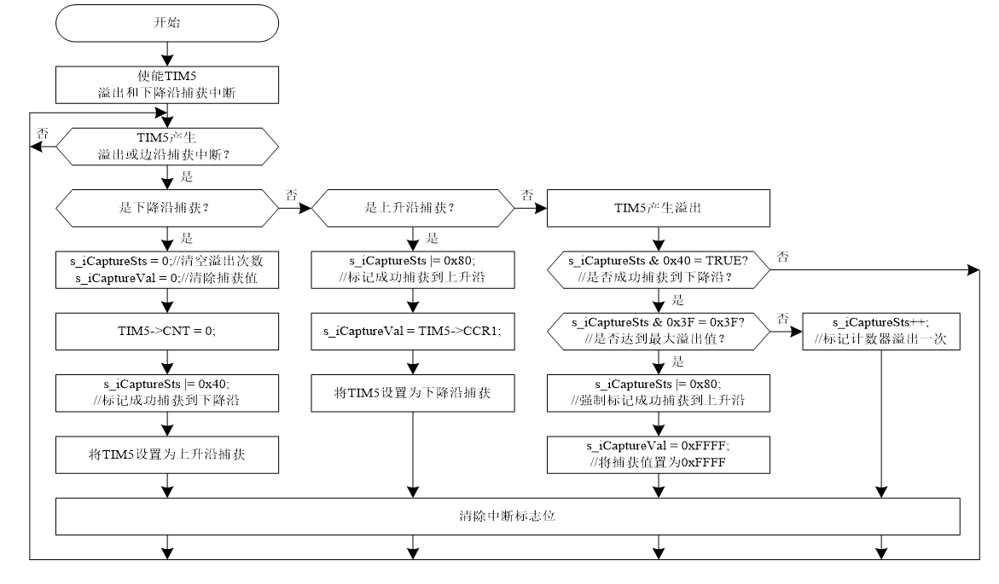

```c
//s_iCaptureSts中的bit7为捕获完成的标志，bit6为捕获到下降沿标志，bit5-bit0为捕获到下降沿后定时器溢出的次数
static  u8  s_iCaptureSts = 0;     //捕获状态 
static  u16 s_iCaptureVal;         //捕获值

static  void ConfigTIM5ForCapture(u16 arr, u16 psc)//GPIO TIMBase TIMIC NVIC
{ 
  GPIO_InitTypeDef        GPIO_InitStructure;    //GPIO_InitStructure用于存放GPIO的参数
  TIM_TimeBaseInitTypeDef TIMx_TimeBaseStructure;//TIM_TimeBaseStructure用于存放定时器的基本参数
  TIM_ICInitTypeDef       TIMx_ICInitStructure;  //TIMx_ICInitStructure用于存放定时器的通道参数
  NVIC_InitTypeDef        NVIC_InitStructure;    //NVIC_InitStructure用于存放NVIC的参数

  //使能RCC相关时钟
  RCC_APB1PeriphClockCmd(RCC_APB1Periph_TIM5, ENABLE);  //使能TIM5的时钟
  RCC_APB2PeriphClockCmd(RCC_APB2Periph_GPIOA, ENABLE); //使能捕获的GPIOA的时钟
  
  //配置PA0，对应TIM5的CH1
  GPIO_InitStructure.GPIO_Pin  = GPIO_Pin_0;            //设置引脚
  GPIO_InitStructure.GPIO_Mode = GPIO_Mode_IPU;         //设置输入模式 
  GPIO_Init(GPIOA, &GPIO_InitStructure);                //根据参数初始化GPIO
  GPIO_SetBits(GPIOA, GPIO_Pin_0);  //将捕获对应的引脚置为高电平
  
  //配置TIM5
  TIMx_TimeBaseStructure.TIM_Period        = arr;                     //设定计数器自动重装值 
  TIMx_TimeBaseStructure.TIM_Prescaler     = psc;                     //设置TIMx时钟频率除数的预分频值  
  TIMx_TimeBaseStructure.TIM_ClockDivision = TIM_CKD_DIV1;            //设置时钟分割
  TIMx_TimeBaseStructure.TIM_CounterMode   = TIM_CounterMode_Up;      //设置定时器TIMx为向上计数模式
  TIM_TimeBaseInit(TIM5, &TIMx_TimeBaseStructure); //根据指定的参数初始化TIMx的时间基数单位
  
  //配置TIM5的CH1为输入捕获
  //CC1S = 01，CC1通道被配置为输入，输入通道IC1映射到定时器引脚TI1上
  TIMx_ICInitStructure.TIM_Channel        = TIM_Channel_1;            //设置输入通道通道 
  TIMx_ICInitStructure.TIM_ICPolarity     = TIM_ICPolarity_Falling;   //设置为下降沿捕获
  TIMx_ICInitStructure.TIM_ICSelection    = TIM_ICSelection_DirectTI; //设置为直接映射到TI1（没有或操作）
  TIMx_ICInitStructure.TIM_ICPrescaler    = TIM_ICPSC_DIV1;           //设置为每一个边沿都捕获，捕捉不分频 
  TIMx_ICInitStructure.TIM_ICFilter       = 0x08;                     //设置输入滤波器
  TIM_ICInit(TIM5, &TIMx_ICInitStructure);         //根据参数初始化TIM5的CH1
  
  //配置NVIC
  NVIC_InitStructure.NVIC_IRQChannel                   = TIM5_IRQn;     //中断通道号   
  NVIC_InitStructure.NVIC_IRQChannelPreemptionPriority = 2;             //设置抢占优先级   
  NVIC_InitStructure.NVIC_IRQChannelSubPriority        = 0;             //设置子优先级   
  NVIC_InitStructure.NVIC_IRQChannelCmd                = ENABLE;        //使能中断   
  NVIC_Init(&NVIC_InitStructure);                                       //根据参数初始化NVIC    
  TIM_ITConfig(TIM5, TIM_IT_Update | TIM_IT_CC1, ENABLE); //使能定时器的更新中断和CC1IE捕获中断 
  
  TIM_Cmd(TIM5, ENABLE);  //使能TIM5
}
void TIM5_IRQHandler(void)
{ 
  if((s_iCaptureSts & 0x80) == 0) //最高位为0，表示捕获还未完成
  {  
    //高电平，定时器TIMx发生了溢出事件
    if(TIM_GetITStatus(TIM5, TIM_IT_Update) != RESET)        
    {    
      if(s_iCaptureSts & 0x40)    //发生溢出，并且前一次已经捕获到低电平
      {
        //TIM_APR 16位预装载值，即CNT > 65536-1（2^16 - 1）时溢出。
        //若不处理，(s_iCaptureSts & 0x3F)++等于0x40 ，溢出数等于清0
        if((s_iCaptureSts & 0x3F) == 0x3F)  //达到多次溢出，低电平太长
        {
          s_iCaptureSts |= 0x80;  //强制标记成功捕获了一次
          s_iCaptureVal = 0xFFFF; //捕获值为0xFFFF
        } 
        else
        {
          s_iCaptureSts++;        //标记计数器溢出一次
        }
      }
    }
    if (TIM_GetITStatus(TIM5, TIM_IT_CC1) != RESET) //发生捕获事件
    { 
      if(s_iCaptureSts & 0x40)  //bit6为1，即上次捕获到下降沿，那么这次捕获到上升沿
      {
        s_iCaptureSts |= 0x80;  //完成捕获，标记成功捕获到一次上升沿
        s_iCaptureVal = TIM_GetCapture1(TIM5);  //s_iCaptureVa记录捕获比较寄存器的值
        //CC1P=1 设置为下降沿捕获，为下次捕获做准备
        TIM_OC1PolarityConfig(TIM5, TIM_ICPolarity_Falling);   
      }
      else  //bit6为0，表示上次没捕获到下降沿，这是第一次捕获下降沿
      {
        s_iCaptureSts = 0;  //清空溢出次数
        s_iCaptureVal = 0;  //捕获值为0
                                                             
        TIM_SetCounter(TIM5, 0);  //设置寄存器的值为0
                                                             
        s_iCaptureSts |= 0x40;    //bit6置为1，标记捕获到了下降沿
        
        TIM_OC1PolarityConfig(TIM5, TIM_ICPolarity_Rising);  //CC1P=0 设置为上升沿捕获
      }    
    } 
  }
  TIM_ClearITPendingBit(TIM5, TIM_IT_CC1 | TIM_IT_Update);    //清除中断标志位
}
void  InitCapture(void)
{
  //计数器达到最大装载值0xFFFF，会产生溢出；以72MHz/（72-1+1）=1MHz的频率计数
  ConfigTIM5ForCapture(0xFFFF, 72 - 1);  
}
```

## 第十六章 DAC

### 1. DAC功能框图

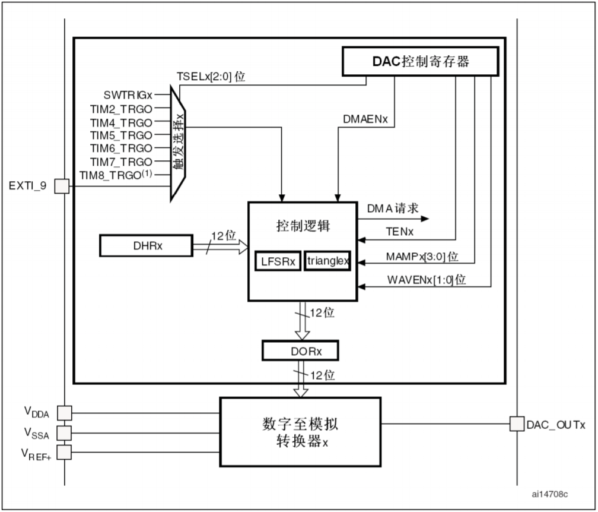

**DAC**有8个触发源，分别是**TIM6 TRGO、TIM3/TIM8 TRGO、TIM7 TRGO、TIM5 TRGO、TIM2 TRGO、TIM4 TRGO、EXTI线路9和SWTRIG（软件触发）**。

波形变量放在**SRAM**中，**DAC**转换先读取存放在**SRAM**中的数字量，然后将其转化为模拟量。因此，为了提高**DAC**工作效率，可通过**DMA2的通道3（DMA2_CH2）**将**SRAM**中的数据传送到**DAC**的**DAC_DHR12R1**。**TIM4**设置为**触发输出**，每10us产生一个触发输出，一旦有触发产生，**DAC_DHR12R1**的数据将会被传送到**DAC_DOR1**，同时，产生一个**DMA**请求，**DMA2**控制器会把**SRAM**中的下一个波形数据搬移到**DAC_DHR12R1**。一旦数据从**DAC_DHR12R1**传入到**DAC_DOR1**，经过时间 **t** 后，**数字至模拟转换器**就会将**DAC_DOR1**中的数据转换为模拟量输出到 **PA4** 引脚。

### 2. DMA功能框图

**DMA1**：

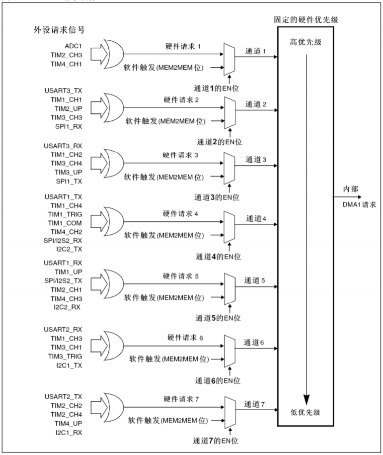

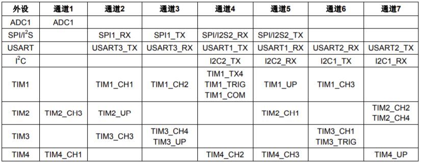

**DMA2**：

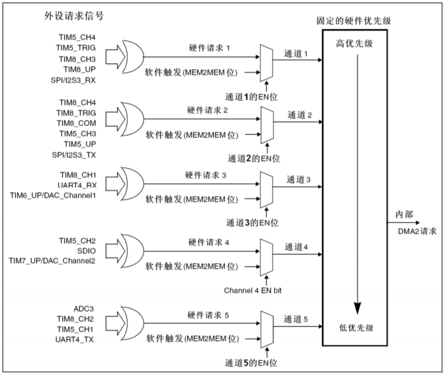

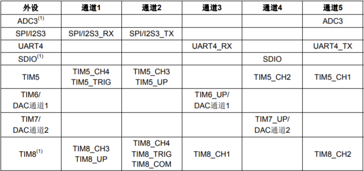

**DMA**数据传输支持从外设到存储器、从存储器到外设、从存储器到存储器。

外设通过产生DMA请求，DMA可以短暂地获取总线的控制权，实现数据从存储器区到外设区的转移。转移完成后，此次DMA请求就结束了。

### 3. 部分固件库函数

- **DAC_Init**：初始化**DAC**
- **DAC_DMACmd**：使能或除能指定的**DAC**通道的**DMA**请求
- **DAC_Cmd**：使能或除能指定的DAC通道
- **DMA_Init**：初始化DMA通道
- **DMA_ITConfig**：使能或除能指定的通道 x 中断
- **DMA_Cmd**：使能或除能指定的通道
- **DMA_ClearITPendingBit**：清除 DMA 通道 x 的中断处理位

### 4. 配置示例

配置**PA4**输出特定的波形。

```c
#define DAC_DHR12R1_ADDR    ((u32)0x40007408)   //DAC1的地址（12位右对齐）DAC映射地址+寄存器偏移地址
static StructDACWave s_strDAC1WaveBuf;  //存储DAC1波形属性，包括波形地址（数组地址）和点数（数组大小）

void ConfigTimer4(u16 arr, u16 psc)
{
  TIM_TimeBaseInitTypeDef TIM_TimeBaseStructure;                  //TIM_TimeBaseStructure用于存放定时器的参数
  
  //使能RCC相关时钟
  RCC_APB1PeriphClockCmd(RCC_APB1Periph_TIM4, ENABLE);            //使能定时器的时钟
  
  //配置TIM4
  TIM_DeInit(TIM4);                                               //重置为缺省值
  TIM_TimeBaseStructure.TIM_Period        = arr;                  //设置自动重装载值   
  TIM_TimeBaseStructure.TIM_Prescaler     = psc;                  //设置预分频器值    
  TIM_TimeBaseStructure.TIM_ClockDivision = TIM_CKD_DIV1;         //设置时钟分割：不分割
  TIM_TimeBaseStructure.TIM_CounterMode   = TIM_CounterMode_Up;   //设置向上计数模式 
  TIM_TimeBaseInit(TIM4, &TIM_TimeBaseStructure);

  TIM_SelectOutputTrigger(TIM4, TIM_TRGOSource_Update);           //选择更新事件为触发输入

  TIM_Cmd(TIM4, ENABLE);                                          //使能定时器
} 
void ConfigDAC1(void)
{
  GPIO_InitTypeDef  GPIO_InitStructure;
  DAC_InitTypeDef   DAC_InitStructure;

  //使能RCC相关时钟
  RCC_APB2PeriphClockCmd(RCC_APB2Periph_GPIOA, ENABLE);          //使能GPIOA的时钟
  RCC_APB1PeriphClockCmd(RCC_APB1Periph_DAC, ENABLE);            //使能DAC的时钟
  
  //配置DAC1 -> PA4
  GPIO_InitStructure.GPIO_Pin   = GPIO_Pin_4;
  GPIO_InitStructure.GPIO_Speed = GPIO_Speed_50MHz;
  GPIO_InitStructure.GPIO_Mode  = GPIO_Mode_AIN;                  //输入类型：模拟输入
  GPIO_Init(GPIOA, &GPIO_InitStructure);
  
  //配置DAC1
  DAC_InitStructure.DAC_Trigger = DAC_Trigger_T4_TRGO;            //设置DAC触发
  DAC_InitStructure.DAC_WaveGeneration = DAC_WaveGeneration_None; //关闭波形发生器
  DAC_InitStructure.DAC_LFSRUnmask_TriangleAmplitude = DAC_LFSRUnmask_Bit0; //不屏蔽LSFR位0/三角波幅值等于1
  DAC_InitStructure.DAC_OutputBuffer = DAC_OutputBuffer_Enable;   //使能DAC输出缓存
  DAC_Init(DAC_Channel_1, &DAC_InitStructure);                    //初始化DAC通道1

  DAC_DMACmd(DAC_Channel_1, ENABLE);                              //使能DAC通道1的DMA模式
 
  DAC_SetChannel1Data(DAC_Align_12b_R, 0);                        //设置为12位右对齐数据格式
  
  DAC_Cmd(DAC_Channel_1, ENABLE);                                 //使能DAC通道1
}
void ConfigDMA2Ch3ForDAC1(StructDACWave wave)
{  
  DMA_InitTypeDef   DMA_InitStructure;
  NVIC_InitTypeDef  NVIC_InitStructure;

  //使能RCC相关时钟
  RCC_AHBPeriphClockCmd(RCC_AHBPeriph_DMA2, ENABLE);               //使能DMA2的时钟  
  
  //配置DMA2_Channel3
  DMA_DeInit(DMA2_Channel3);                                       //将DMA1_CH1寄存器设置为默认值
  DMA_InitStructure.DMA_PeripheralBaseAddr = DAC_DHR12R1_ADDR;     //设置外设地址
  DMA_InitStructure.DMA_MemoryBaseAddr     = wave.waveBufAddr;     //设置存储器地址
  DMA_InitStructure.DMA_BufferSize         = wave.waveBufSize;     //设置要传输的数据项数目                                              
  DMA_InitStructure.DMA_DIR                = DMA_DIR_PeripheralDST;//设置为存储器到外设模式
  DMA_InitStructure.DMA_PeripheralInc      = DMA_PeripheralInc_Disable;  //设置外设为非递增模式
  DMA_InitStructure.DMA_MemoryInc          = DMA_MemoryInc_Enable;       //设置存储器为递增模式
  DMA_InitStructure.DMA_PeripheralDataSize = DMA_PeripheralDataSize_HalfWord; //设置外设数据长度为半字
  DMA_InitStructure.DMA_MemoryDataSize     = DMA_MemoryDataSize_HalfWord;	    //设置存储器数据长度为半字
  DMA_InitStructure.DMA_Mode               = DMA_Mode_Circular;    //设置为循环模式
  DMA_InitStructure.DMA_Priority           = DMA_Priority_High;    //设置为高优先级
  DMA_InitStructure.DMA_M2M                = DMA_M2M_Disable;      //禁止存储器到存储器访问
  DMA_Init(DMA2_Channel3, &DMA_InitStructure);                     //根据参数初始化DMA2_Channel3

  //配置NVIC
  NVIC_InitStructure.NVIC_IRQChannel = DMA2_Channel3_IRQn;         //中断通道号
  NVIC_InitStructure.NVIC_IRQChannelPreemptionPriority = 0;        //设置抢占优先级
  NVIC_InitStructure.NVIC_IRQChannelSubPriority = 0;               //设置子优先级
  NVIC_InitStructure.NVIC_IRQChannelCmd = ENABLE;                  //使能中断
  NVIC_Init(&NVIC_InitStructure);                                  //根据参数初始化NVIC 

  DMA_ITConfig(DMA2_Channel3, DMA_IT_TC, ENABLE);                  //使能DMA2_Channel3的传输完成中断 

  DMA_Cmd(DMA2_Channel3, ENABLE);                                  //使能DMA2_Channel3
}
void DMA2_Channel3_IRQHandler(void)
{
  if(DMA_GetITStatus(DMA2_IT_TC3))                                //判断DMA2_Channel3传输完成中断是否发生
  {
    NVIC_ClearPendingIRQ(DMA2_Channel3_IRQn);                     //清除DMA2_Channel3中断挂起
    DMA_ClearITPendingBit(DMA2_IT_GL3);                           //清除DMA2_Channel3传输完成中断标志

    //ConfigDMA2Ch3ForDAC1(s_strDAC1WaveBuf);                       //配置DMA2通道3
  }
}
void InitDAC(void)
{              
  s_strDAC1WaveBuf.waveBufAddr  = (u32)GetSineWave100PointAddr();  //波形地址
  s_strDAC1WaveBuf.waveBufSize  = 100;                             //波形点数  

  ConfigDAC1();                                                    //配置DAC1
  ConfigTimer4(799, 719);                                          //100KHz，计数到800为8ms   
  ConfigDMA2Ch3ForDAC1(s_strDAC1WaveBuf);                          //配置DMA2通道3
}
```


## 第十七章 ADC

### 1. ADC功能框图

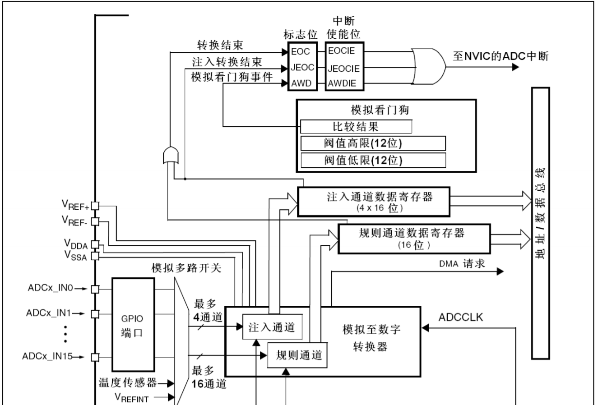

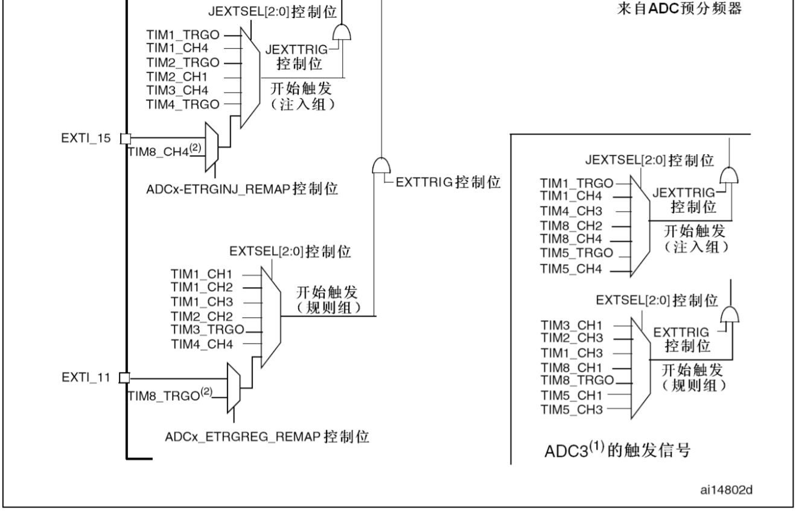

### 2. 配置示例

配置**PA1**为**ADC**引脚。

```c
i32 s_arrADC1Data;   //存放ADC转换结果数据
void ConfigADC1(void)
{                          
  GPIO_InitTypeDef  GPIO_InitStructure;                             //GPIO_InitStructure用于存放GPIO的参数
  ADC_InitTypeDef   ADC_InitStructure;                              //ADC_InitStructure用于存放ADC的参数

  //使能RCC相关时钟
  RCC_ADCCLKConfig(RCC_PCLK2_Div6);                                 //设置ADC时钟分频，ADCCLK=PCLK2/6=12MHz
  RCC_APB2PeriphClockCmd(RCC_APB2Periph_ADC1  , ENABLE);            //使能ADC1的时钟
  RCC_APB2PeriphClockCmd(RCC_APB2Periph_GPIOA , ENABLE);            //使能GPIOA的时钟
 
  //配置ADC1的GPIO
  GPIO_InitStructure.GPIO_Pin   = GPIO_Pin_1;
  GPIO_InitStructure.GPIO_Mode  = GPIO_Mode_AIN;                    //输入类型：模拟输入
  GPIO_Init(GPIOA, &GPIO_InitStructure);

  //配置ADC1
  ADC_InitStructure.ADC_Mode               = ADC_Mode_Independent;  //设置为独立模式
  ADC_InitStructure.ADC_ScanConvMode       = ENABLE;                //使能扫描模式
  ADC_InitStructure.ADC_ContinuousConvMode = DISABLE;               //禁止连续转换模式
  ADC_InitStructure.ADC_ExternalTrigConv   = ADC_ExternalTrigConv_T3_TRGO;  //使用TIM3触发
  ADC_InitStructure.ADC_DataAlign          = ADC_DataAlign_Right;   //设置为右对齐
  ADC_InitStructure.ADC_NbrOfChannel       = 1;                     //设置ADC的通道数目
  ADC_Init(ADC1, &ADC_InitStructure);

  ADC_RegularChannelConfig(ADC1, ADC_Channel_1, 1, ADC_SampleTime_239Cycles5); //设置采样时间为239.5个周期

  ADC_DMACmd(ADC1, ENABLE);                                         //使能ADC1的DMA
  ADC_ExternalTrigConvCmd(ADC1, ENABLE);                            //使用外部事件启动ADC转换
  ADC_Cmd(ADC1, ENABLE);                                            //使能ADC1
  ADC_ResetCalibration(ADC1);                                       //启动ADC复位校准，即将RSTCAL赋值为1
  while(ADC_GetResetCalibrationStatus(ADC1));                       //读取并判断RSTCAL，RSTCAL为0跳出while语句
  ADC_StartCalibration(ADC1);                                       //启动ADC校准，即将CAL赋值为1
  while(ADC_GetCalibrationStatus(ADC1));                            //读取并判断CAL，CAL为0跳出while语句
}
void ConfigDMA1Ch1(void)
{
  DMA_InitTypeDef DMA_InitStructure;                                //DMA_InitStructure用于存放DMA的参数
  
  //使能RCC相关时钟
  RCC_AHBPeriphClockCmd(RCC_AHBPeriph_DMA1, ENABLE);                //使能DMA1的时钟
  
  //配置DMA1_Channel1
  DMA_DeInit(DMA1_Channel1);                                        //将DMA1_CH1寄存器设置为默认值
  DMA_InitStructure.DMA_PeripheralBaseAddr = (uint32_t)&(ADC1->DR);           //设置外设地址
  /**/
  DMA_InitStructure.DMA_MemoryBaseAddr     = (uint32_t)&s_arrADC1Data;        //设置存储器地址
  /**/
  DMA_InitStructure.DMA_DIR                = DMA_DIR_PeripheralSRC;           //设置为外设到存储器模式
  DMA_InitStructure.DMA_BufferSize         = 1;                               //设置要传输的数据项数目
  DMA_InitStructure.DMA_PeripheralInc      = DMA_PeripheralInc_Disable;       //设置外设为非递增模式
  DMA_InitStructure.DMA_MemoryInc          = DMA_MemoryInc_Enable;            //设置存储器为递增模式
  DMA_InitStructure.DMA_PeripheralDataSize = DMA_PeripheralDataSize_HalfWord; //设置外设数据长度为半字
  DMA_InitStructure.DMA_MemoryDataSize     = DMA_MemoryDataSize_HalfWord;     //设置存储器数据长度为半字
  DMA_InitStructure.DMA_Mode               = DMA_Mode_Circular;               //设置为循环模式
  DMA_InitStructure.DMA_Priority           = DMA_Priority_Medium;             //设置为中等优先级
  DMA_InitStructure.DMA_M2M                = DMA_M2M_Disable;                 //禁止存储器到存储器访问
  DMA_Init(DMA1_Channel1, &DMA_InitStructure);                      //根据参数初始化DMA1_Channel1
  
  DMA_Cmd(DMA1_Channel1, ENABLE);                                   //使能DMA1_Channel1
}
void ConfigTimer3(u16 arr, u16 psc)
{
  TIM_TimeBaseInitTypeDef  TIM_TimeBaseStructure;
  NVIC_InitTypeDef NVIC_InitStructure;
    
  //使能RCC相关时钟
  RCC_APB1PeriphClockCmd(RCC_APB1Periph_TIM3, ENABLE);                        //使能TIM3的时钟

  //配置TIM3
  TIM_TimeBaseStructure.TIM_Period        = arr;                              //设置自动重装载值
  TIM_TimeBaseStructure.TIM_Prescaler     = psc;                              //设置预分频器值
  TIM_TimeBaseStructure.TIM_ClockDivision = TIM_CKD_DIV1;                     //时钟分割：不分割
  TIM_TimeBaseStructure.TIM_CounterMode   = TIM_CounterMode_Up;               //设置向上计数模式
  TIM_TimeBaseInit(TIM3, &TIM_TimeBaseStructure);
  
  TIM_SelectOutputTrigger(TIM3,TIM_TRGOSource_Update);                        //选择更新事件为触发输入
  
  TIM_ITConfig(TIM3, TIM_IT_Update,ENABLE);                                   //使能定时器的更新中断
  
  //配置NVIC
  NVIC_InitStructure.NVIC_IRQChannel      = TIM3_IRQn;                        //中断通道号
  NVIC_InitStructure.NVIC_IRQChannelPreemptionPriority = 1;                   //设置抢占优先级
  NVIC_InitStructure.NVIC_IRQChannelSubPriority        = 1;                   //设置子优先级
  NVIC_InitStructure.NVIC_IRQChannelCmd   = ENABLE;                           //使能中断
  NVIC_Init(&NVIC_InitStructure);                                             //根据参数初始化NVIC
  
  TIM_Cmd(TIM3, ENABLE);                                                      //使能定时器
}
void TIM3_IRQHandler(void)//可省略
{  
  if (TIM_GetITStatus(TIM3, TIM_IT_Update) == SET)  //判断定时器更新中断是否发生
  {
    TIM_ClearITPendingBit(TIM3, TIM_FLAG_Update);     //清除定时器更新中断标志 
  }  
}
void InitADC(void)
{
  ConfigTimer3(799, 719);   //100KHz，计数到800为8ms
  ConfigADC1();             //配置ADC1
  ConfigDMA1Ch1();          //配置DMA1的通道1 
}
```

