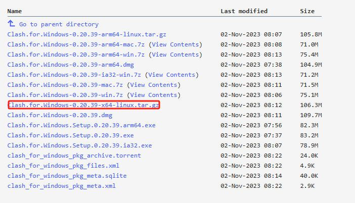
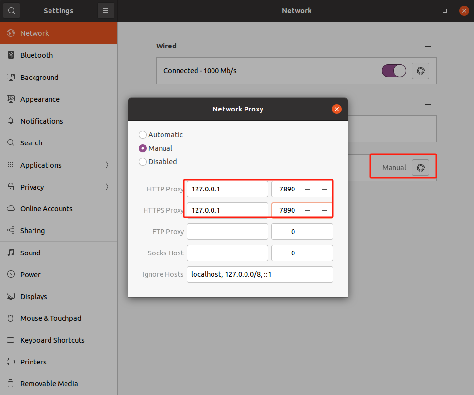

#### 下载clash for windows的x64-linux版本

[https://archive.org/download/clash_for_windows_pkg](https://archive.org/download/clash_for_windows_pkg)

#### 在将压缩包导入Ubuntu并解压，进入该目录后执行./cfw

#### 购买节点并导入

[https://fastfly.club/](https://fastfly.club/)

#### 在Ubuntu设置中修改以下内容

