# 数字信号处理

## 前置知识

### 时域采样定理

原信号$x(t)$经过周期为$T$（采样频率为$f_s$，采样角频率为$w_s$）的冲激串采样后，得到采样信号$x_p(t)$。观察采样信号$x_p(t)$的离散时间傅里叶变换可以发现，$X_p(jw)$是$X(jw)$以周期为$w_s$的延拓[$^{[2]}$](https://www.bilibili.com/video/BV13P411P7Pv/?p=14&vd_source=ee2c602d51f4cb1787b896796df4d5c4)。


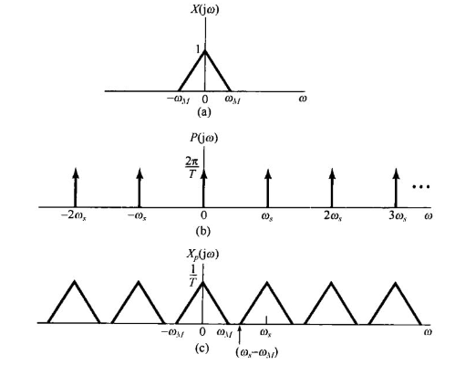

为了复现原信号的全部信息，要求离散频谱彼此互不重叠，采样角频率$w_s$应大于等于信号最高角频率的两倍，即：

$$w_s>=2w_m$$

### 模拟滤波器转化为数字滤波器

模拟滤波器转化为数字滤波器有两种方法，分别是**脉冲响应不变法**和**双线性变换法**。由于**脉冲响应不变法**无法设计**高通**和**带阻**滤波器，所以一般使用**双线性变换法**[$^{[3]}$](https://www.bilibili.com/video/BV13P411P7Pv?p=75&vd_source=ee2c602d51f4cb1787b896796df4d5c4)。

**双线性变换法**从$s$域到$z$与的转换公式为：

$$\frac{2}{T}\frac{1-z^{-1}}{1+z^{-1}}$$

其中，$T$为采样周期，对应采样频率和采样角频率$f_s$和$\omega_s$。

由于$z$域上的$\omega$与$s$域上的$\Omega$是正切关系而不是线性关系，有可能在转化过程中产生频域上的畸变。因此，在实际转化中，还需要**预畸变处理**。

### 系统函数转化为差分方程

由系统函数

$$H(z)=\frac{b_0+b_1z^{-1}+b_2z^{-2}+...+b_nz^{n}}{1+a_1z^{-1}+a_2z^{-2}+...+a_nz^{n}}$$

得到差分方程

$$y[n]=b_1x[n]+b_2x[n-1]+b_3[n-2]+...+b_nx[1]-(a_2y[n-1]+a_3y[n-2]+...+a_ny[1])$$

即可写出代码。

## 经典数字滤波器设计

### Butterworth滤波器

巴特沃斯滤波器是IIR模拟滤波器，具有**通带最平坦，阻带下降慢**的特点，它的$s$域归一化系统函数为：

$$H(s)=\frac{1}{1+a_1s+a_2s^2+...+a_ns^{n-1}}$$

分母即为归一化巴特沃斯多项式，对应不同阶数为：

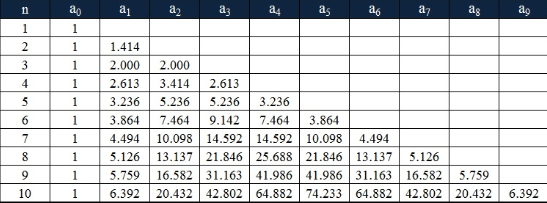

以二阶低通巴特沃斯滤波器为例，介绍系数的计算方法。假设采样频率为$f_s$，设计截止频率为$f_c$（$f_c<=f_s$），则带预畸变处理的转化函数为[$^{[4]}$](https://blog.csdn.net/sszhouplus/article/details/43113505)：

$$s=\frac{1}{C}\frac{1-z^{-1}}{1+z^{-1}}$$

$$C=tan(\frac{\omega_c}{2})$$

$$\omega_c=2\pi\frac{f_c}{f_s}$$

将上式带入二阶$H(s)$可得，令$G=\frac{1}{C^2+\sqrt{2}C+1}$：

$$b_0=GC^2,b_1=2b_0,b_2=b_0$$

$$a_0=1,a_1=G(2C^2-2),a_2=G(C^2-\sqrt{2}C+1)$$

代码如下：

```c
float Butterworth_Lowpass_Order2_Filter(float input, float fs, float fc)
{
  static float a[3], b[3];
  static float x[2], y[2];
  float output = 0;

  typedef enum
  {
    _Initialization,
    _Operation,
  } state_t;

  static state_t state = _Initialization;

  switch (state)
  {
  case _Initialization: /* 计算系数 */

    float C = tanf(PI * fc / fs);
    float G  = 1 / (C * C + sqrtf(2) * C + 1);

    b[0] = G * C * C;
    b[1] = 2 * b[0];
    b[2] = b[0];

    a[0] = 1;
    a[1] = G * (2 * C * C - 2);
    a[2] = G * (C * C - sqrtf(2) * C + 1);

    printf("%f %f %f \r\n %f %f %f\r\n", b[0], b[1], b[2], a[0], a[1], a[2]);
    state = _Operation;
    // 第一次进入函数需要计算系数，此处无break
    // break;
  case _Operation: /* 滤波器差分方程输出 */

    output = b[0] * input + b[1] * x[0] + b[2] * x[1] - a[1] * y[0] - a[2] * y[1];

    x[1] = x[0];
    x[0] = input;
    y[1] = y[0];
    y[0] = output;

    break;

  default:
    return 0;
    break;
  }
  return output;
}
```

系数可以直接通过MATLAB的滤波器设计工具得到，步骤如下：

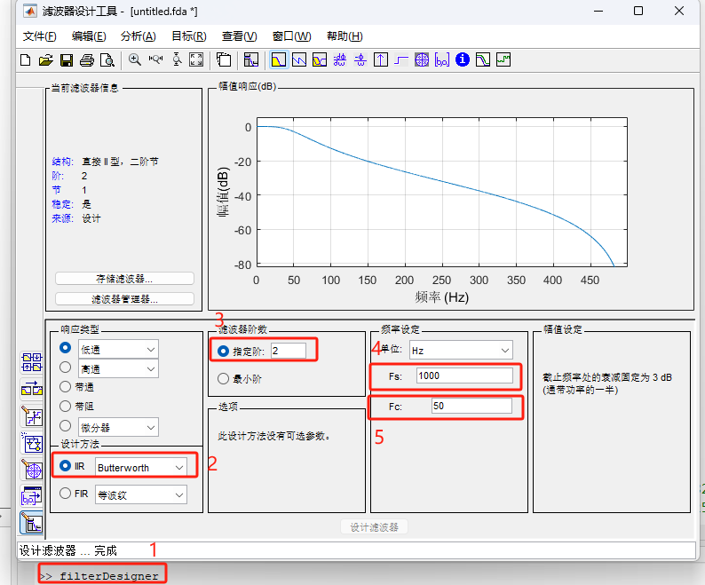

查看系数：

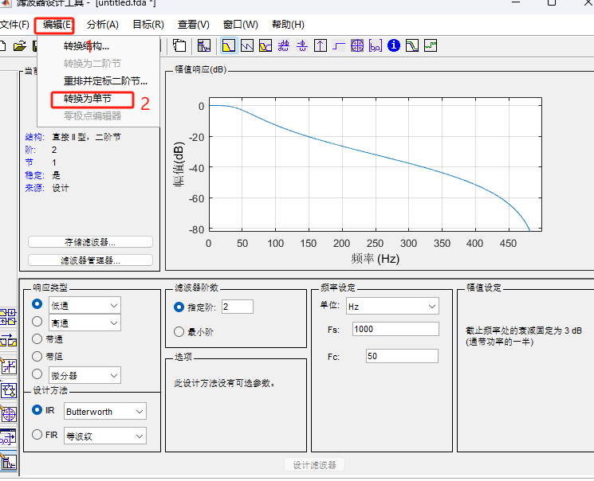

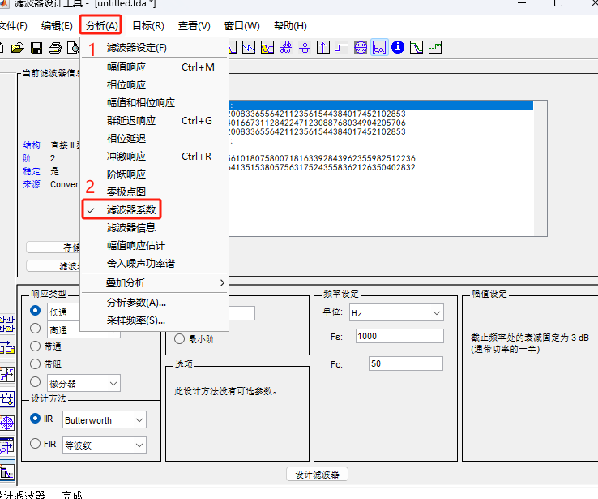

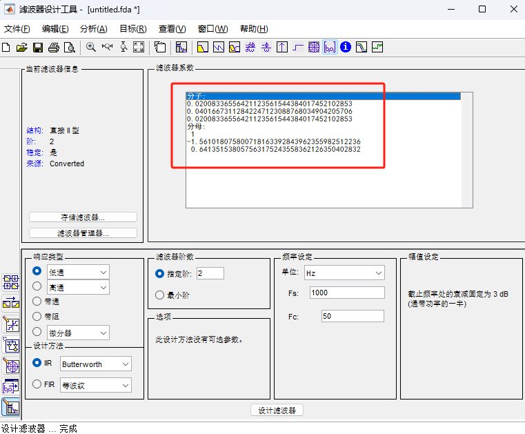

使用这种方法可以方便地设计高阶滤波器的系数，再将得到的系数填入代码中即可。

### 简单移动平均滤波器[$^{[5]}$](https://zh.wikipedia.org/wiki/%E7%A7%BB%E5%8B%95%E5%B9%B3%E5%9D%87#)


移动平均滤波器是$FIR$滤波器，这里以三点移动平均滤波器为例，差分方程为：

$$y[n]=\frac{1}{3}(x[n]+x[n-1]+x[n-2])$$

可得系统函数为：

$$H(z)=\frac{1}{3}(1+z^{-1}+z^{-2})$$

用MATLAB画出频率响应：

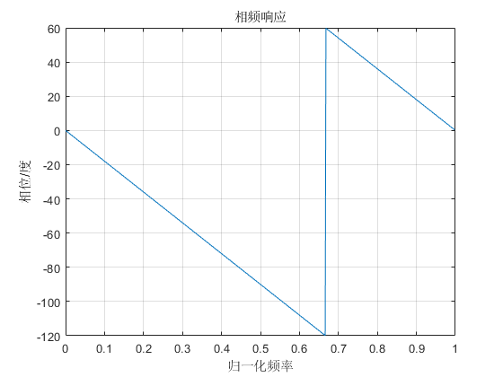

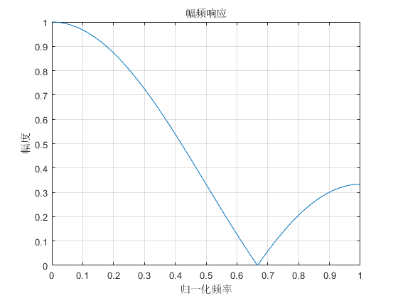

代码：

```c
float Moving_Average3_Filter(float input)
{
    static float x[2];

    float output = (input + x[0] + x[1]) / 3;

    x[1] = x[0];
    x[0] = input;   

    return output;
}
```

### 指数移动平均滤波器

指数移动平均是以指数式递减加权的移动平均，各数值的加权影响力随时间而指数衰减，近期的数据权值越重。差分方程为：

$$y[n]=(1-\alpha)y[n-1]+\alpha x[n]，\alpha\in(0, 1)$$

其中$\alpha$是时间因子，$\alpha$越接近$1$，加权平均的数也就越少；$\alpha$越接近$0$，平滑效果越好。$\alpha$可以用加权数$N$来代表：$\alpha=\frac{2}{N+1}$。例如，当$N=2$时，$\alpha=\frac{2}{3}$。

系统函数为：

$$H(z)=\frac{\alpha}{1+(\alpha-1)z^{-1}}$$

用MATLAB画出频率响应，可以看出$\alpha$越小，系统的延迟越高：

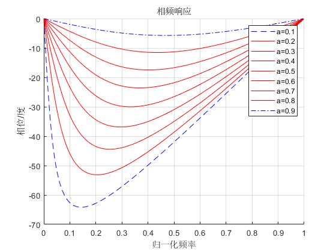

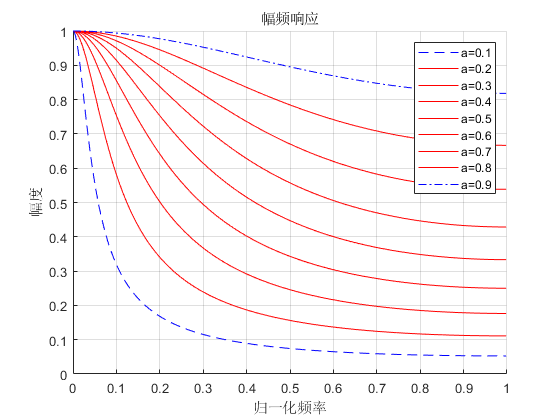

以下是对一组心电数据用两个不同的$\alpha$值进行滤波：

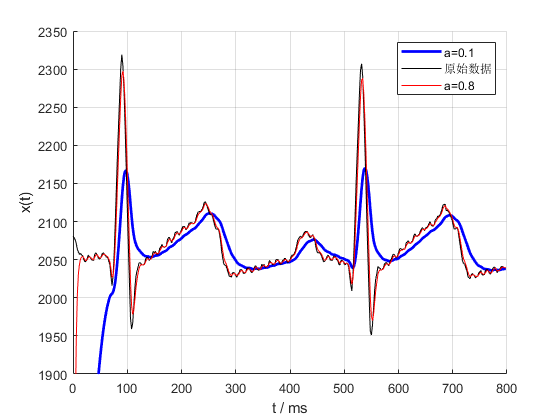

代码：

```c
float Exponential_Moving_Average_Filter(float input, float a)
{
  static float y_last;

  // 时间因子在0到1之间
  if(a <= 0 || a >= 1) return -1;

  float output = (1 - a) * y_last + a * input;

  y_last = output;

  return output;
}
```


## 现代数字滤波器设计

## CMSIS-DSP库介绍

### 效率


限幅滤波法

中值滤波（非线性时不变系统）

融合型滤波

加权平均滤波

去除信号中的趋势项（抑制零漂）

**TODO: 零极点图需要确认**


$z$变换

$$(z)=\sum_{n=-\infty}^{+\infty}x[n]z^{-n}, z=re^{jw}$$


# 离散信号处理


[[1] 数字信号处理课程](https://www.bilibili.com/video/BV13P411P7Pv/?p=1&vd_source=ee2c602d51f4cb1787b896796df4d5c4)

[[2] 采样定理推导](https://www.bilibili.com/video/BV13P411P7Pv/?p=14&vd_source=ee2c602d51f4cb1787b896796df4d5c4)

[[3] 双线性变换法推导](https://www.bilibili.com/video/BV13P411P7Pv?p=75&vd_source=ee2c602d51f4cb1787b896796df4d5c4)

[[4] 巴特沃斯滤波器系数推导](https://blog.csdn.net/sszhouplus/article/details/43113505)

[[5] 移动平均滤波器](https://zh.wikipedia.org/wiki/%E7%A7%BB%E5%8B%95%E5%B9%B3%E5%9D%87#)