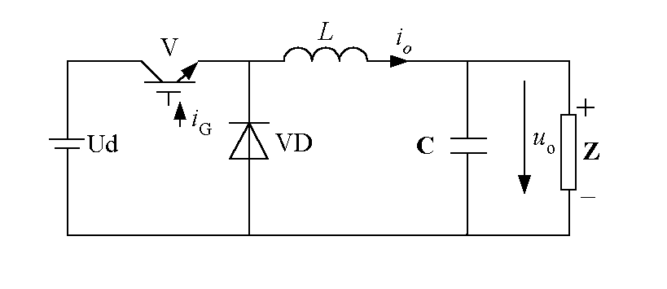
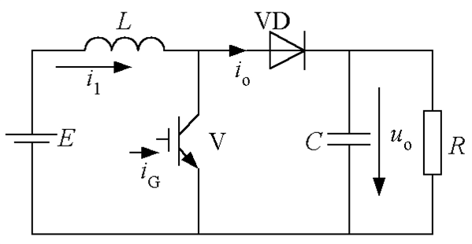
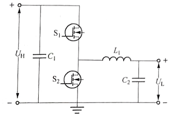
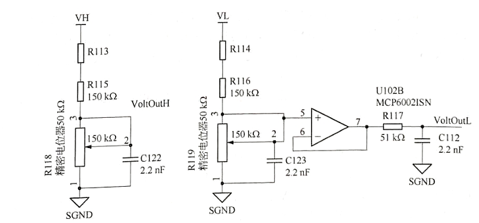
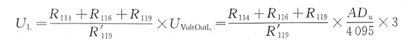
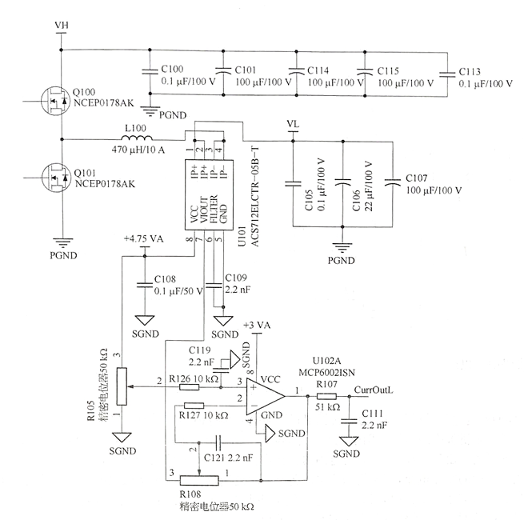
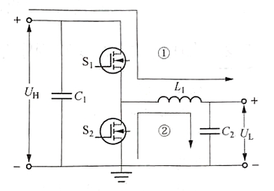
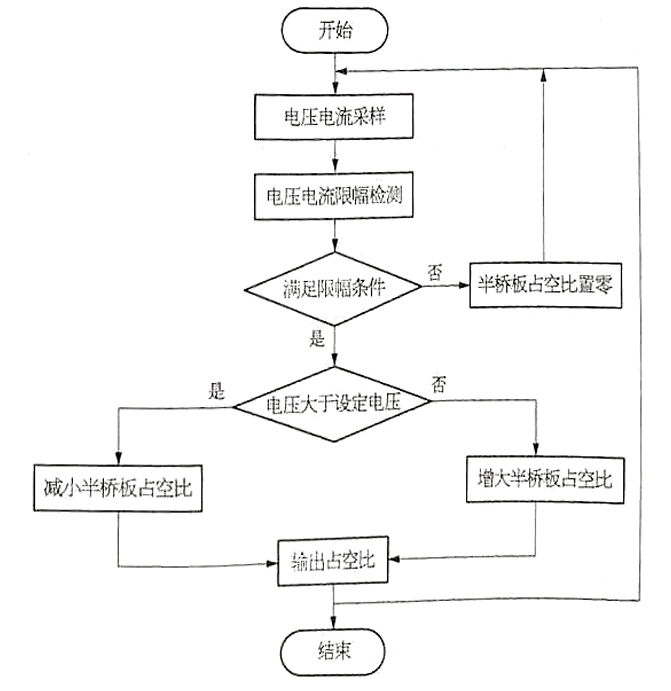

## 开关电源 [1]

### buck降压电路

开关闭合时，二极管截止，电源为电感和负载供电。由于电感上的电流不能突变，会产生与电源相反的电动势，阻碍电流的变化。

开关断开时，二极管导通，由于电感上的电流不能突变，会产生与电源相同的电压。通过控制开关闭合时间，能使输出电源维持在一定水平。

### boost升压电路

开关闭合时，电源为电感充电。

开关断开时时，二极管导通，负载电压为电感电压与电源电压之和。通过控制开关闭合时间，能使输出电源维持在一定水平。

### boost-buck变换器

**《电子电力开发系统》**

## 第四章 基础电路

### 半桥电路

改进后的板桥电路，电流既可以从$U_H$流向$H_L$，也可以从$U_L$流向$U_H$，具有双向DC-DC变换功能。当$U_H$作为输入，$U_L$作为输出时，半桥电路工作在降压模式；当$U_L$作为输入，$U_H$作为输出时，板桥电路工作在升压模式。

### 电压采样电路

$V_L$端比$V_H$端多了电压跟随器和电容滤波电路。电阻分压，输出电压用adc进行采样。电压跟随器的输入电压与输出电压量程约接近，精度越高。计算公式为：

### 电流采样电路

霍尔传感器串联在$V_H$和$V_L$之间，用于测量回路中电流的大小。输入电流经霍尔传感器转化为电压信号，然后经过差分放大电路和滤波电路输出至adc通道进行采用。

霍尔传感器的输入电流与输出电压成线性关系。

## 第五章 降压斩波电路

当半桥电路的上下臂输入两路互补控制信号时，必须设置死区时间，保证一个周期内只有一个开关导通。如果上下桥MOSFET同时导通，电流将直接从电源流向地，将对MOSFET造成损坏。应该保证$S_2$与$S_1$呈互补状态或S2始终处于断开状态。

在一个周期内，开关管$S_1$导通时，电流回路如1所示，电源向负载供电，理想情况下输入电压与输出电压基本相等$U_L=U_H$；开关管$S_1$断开时，电流回路如2所示，输出电压$U_L=0$。负载电流呈指数曲线下降。为了使负载电流连续且脉动小，通常串接感值较大的电感。一个周期内$U_L$的计算公式为$U_L=\alpha U_H$ ，其中$\alpha$为$S_1$的占空比。

根据对输出电压平均值进行调制的方式不同，斩波电路有3种控制方式：1、开关周期不变，改变导通时间以改变占空比称为脉冲宽度调制；2、开关导通时间不变，改变开关周期以改变占空比称为频率调制；3、混合调制。

[[1] 开关电路参考](https://tangqixiang.blog.csdn.net/article/details/127239261)

