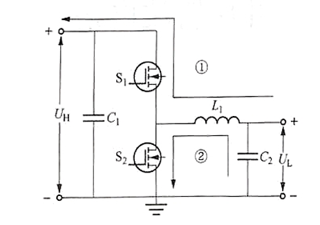
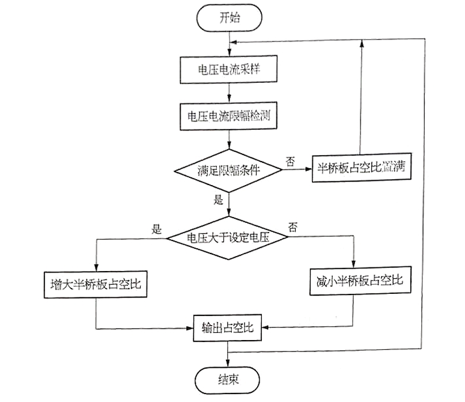
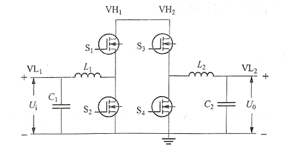
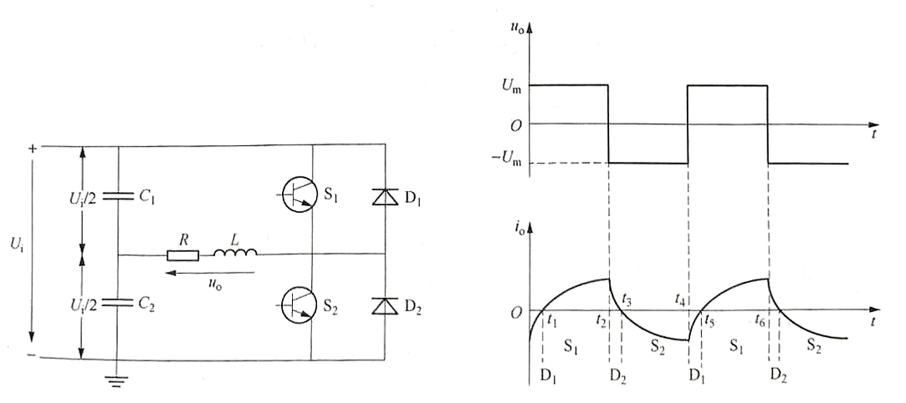
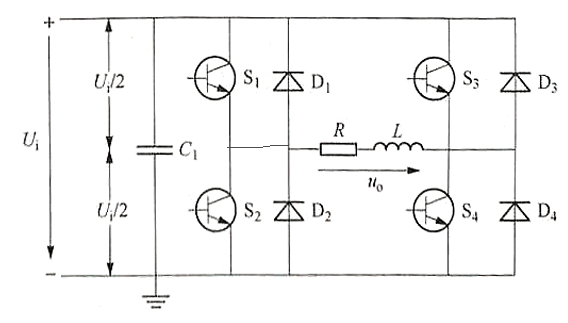
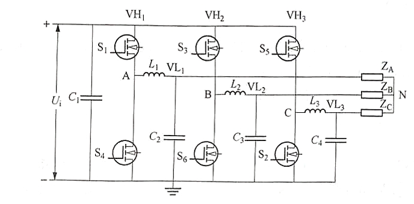
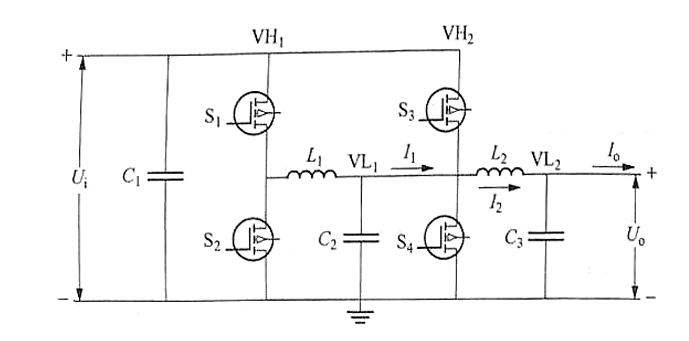

## 功率地与信号地

## 开关电源[$^{[1]}$](https://tangqixiang.blog.csdn.net/article/details/127239261)

### buck降压电路

开关闭合时，二极管截止，电源为电感和负载供电。由于电感上的电流不能突变，会产生与电源相反的电动势，阻碍电流的变化。

开关断开时，二极管导通，由于电感上的电流不能突变，会产生与电源相同的电压。通过控制开关闭合时间，能使输出电源维持在一定水平。

### boost升压电路

开关闭合时，电源为电感充电。

开关断开时时，二极管导通，负载电压为电感电压与电源电压之和。通过控制开关闭合时间，能使输出电源维持在一定水平。

### boost-buck变换器

# 《电子电力开发系统》[$^{[2]}$](https://item.jd.com/10038276537998.html)

## 第四章 基础电路

### 半桥电路

改进后的板桥电路，电流既可以从$U_H$流向$H_L$，也可以从$U_L$流向$U_H$，具有双向DC-DC变换功能。当$U_H$作为输入，$U_L$作为输出时，半桥电路工作在降压模式；当$U_L$作为输入，$U_H$作为输出时，板桥电路工作在升压模式。

### 电压采样电路

$V_L$端比$V_H$端多了电压跟随器和电容滤波电路。电阻分压，输出电压用adc进行采样。电压跟随器的输入电压与输出电压量程约接近，精度越高。计算公式为：

### 电流采样电路

霍尔传感器串联在$V_H$和$V_L$之间，用于测量回路中电流的大小。输入电流经霍尔传感器转化为电压信号，然后经过差分放大电路和滤波电路输出至adc通道进行采用。

霍尔传感器的输入电流与输出电压成线性关系。

## 第五章 降压斩波电路

当半桥电路的上下臂输入两路互补控制信号时，必须设置死区时间，保证一个周期内只有一个开关导通。如果上下桥MOSFET同时导通，电流将直接从电源流向地，将对MOSFET造成损坏。应该保证$S_2$与$S_1$呈互补状态或$S_2$始终处于断开状态。

在一个周期内，开关管$S_1$导通时，电流回路如①所示，电源向负载供电，理想情况下输入电压与输出电压基本相等$U_L=U_H$；开关管$S_1$断开时，电流回路如②所示，输出电压$U_L=0$。负载电流呈指数曲线下降。为了使负载电流连续且脉动小，通常串接感值较大的电感。一个周期内$U_L$的计算公式为$U_L=\alpha U_H$ ，其中$\alpha$为$S_1$的占空比。

根据对输出电压平均值进行调制的方式不同，斩波电路有3种控制方式：1、开关周期不变，改变导通时间以改变占空比称为脉冲宽度调制；2、开关导通时间不变，改变开关周期以改变占空比称为频率调制；3、混合调制。

程序设计思路：

## 第六章 升压斩波电路

升压斩波电路需要进行严格的限幅设置，以防电压过高而烧坏电路。

假设电路中电感感值$L$很大，电容容值$C$也很大。输入端为$V_L$，输出端为$V_H$。开关管$S_1$和$S_2$处于互补导通的状态，通过控制开关管$S_2$的通断，电路有两种不同的工作回路。在一个周期内，开关管$S_2$导通时，$S_1$关闭，电流回路如②所示，**电源向电容$C_2$供电，同时电容$C_1$向负载供电，使输出电压基本保持不变**。开关管$S_2$断开时，电流回路如①所示，**电源和电感储存的能量同时向负载供电，并对电容$C_1$充电，实现升压。下一个周期重复上述过程，使电压保持稳定**。

设开关管$S_1$的占空比为$\alpha$，开关管$S_2$与$S_1$互补，占空比为$\alpha_{'}=1-\alpha$，则升压公式为：

$$U_H=\frac{1}{\alpha}U_L$$

程序设计思路与第五章一致。

## 第七章 升降压斩波电路

使用通用半桥板实现升降压斩波电路的原理是将两个通用半桥半串接在一起，同名端相连，组成全桥电路。若第一块通用半桥板处于升压电路模式，为升压半桥板；第二块通用半桥板处于降压模式，为降压半桥板。将升压半桥板的$U_L$作为输入端接电源，输出端$U_H$与降压半桥板的$U_H$相连，降压半桥板的$U_L$接负载，则构成一个先升压再降压的升降压斩波电路。相反，第一块半桥板处于降压模式，第二块半桥板处于升压模式，降压半桥板的$U_H$作为输入端接电源，$U_L$与升压半桥板的$U_L$相接，升压半桥板的$U_H$接负载，，则构成一个先降压再升压的升降压斩波电路。以下搭建先升压后降压的全桥电路（$U_H$相连）。

当开关管$S_3$始终导通，$S_4$始终关闭时，此电路等效为升压斩波电路。

当开关管$S_1$始终导通，$S_2$始终关闭时，此电路等效为降压斩波电路。

在一个周期内，开关管$S_1$的占空比为$\alpha_1$，开关管$S_3$的占空比为$\alpha_2$，可以得到输出电压的公式：

$$U_o=\alpha_2\times\frac{1}{\alpha_1}U_i=\frac{\alpha_2}{\alpha_1}U_i$$

当$\frac{\alpha_2}{\alpha_1}<1$时，输出电压小于输入电压，电路工作在降压模式；

当$\frac{\alpha_2}{\alpha_1}>1$时，输出电压大于输入电压，电路工作在升压模式。

为了得到最高的电源转化效率，有以下结论：**当电路工作在降压模式时，若升压半桥的占空比$\alpha_1=100\%$，即升压半桥电压增益为1，则电路的转化效率最高；当电路工作在升压模式时，若降压半桥的占空比$\alpha_2=100\%$，即降压半桥的电压增益为1，则电路的转化效率最高。**

## 第八章 直流电子负载

## 第九章 单向逆变电路

逆变电路是把直流电变成交流电的电路。根据**交流侧的负载**情况可将其分为**有源逆变电路**和**无源逆变电路**；当交流侧连接电源时称为有源逆变，当交流侧只连接负载时称为无源逆变。逆变电路根据直流侧的电源性质可分为**电压型逆变电路**和**电流型逆变电路**：当直流侧为电压源输入则称为电压型逆变电路，当直流侧为电流源输入则称为电流型逆变电路。单向逆变电路按拓扑来分又可分为**半桥逆变电路**和**全桥逆变电路**。本章以**无源电压型逆变电路**为例进行讲解，即交流侧连接负载、直流侧为电压输入。

电压型逆变电路有以下特点：

直流侧为电压源，或者并联有大电容，相当于电压源。直流侧电压基本无脉动，直流回路呈现低阻抗；

由于直流电压源的钳位作用，交流侧输出电压波形为矩形波，并且与负载阻抗角无关。而交流侧输出电流波形和相位因负载阻抗的情况不同而不同；

当交流侧为无感负载时需要提供无功功率，直流侧电容起缓冲无功能量的作用。为了给交流侧向直流侧反馈的无功能量提供通道，逆变桥各桥臂都并联了续流二极管。

逆变电路主要考虑**变频和变幅**两个因素。衡量交流信号质量的一个重要指标是总**谐波失真率（THD）**，指信号中谐波成分与实际信号的对比，用百分比表示。

### 半桥逆变电路

设开关器件$S_1$和$S_2$的栅极信号在一个周期内有半个周期正向偏置，有半个周期反向偏置，则输出电压$u_o$为方波，其幅值为$\frac{U_i}{2}$。输出电流$i_o$随负载不同而不同。若负载为感谢器件，则输出电流的波形如上所示。

半桥逆变电路的优点是拓扑简单，使用器件少。缺点是输出电压的幅值为$\frac{U_i}{2}$，且直流侧需要两个电容器串联，工作时需要控制两个电容器电压的均衡。因此，半桥逆变电路适用于几千瓦以下的小功率逆变电路。

### 全桥逆变电路

全桥逆变电路的拓扑如下所示：

图中$S_1$、$S_2$、$S_3$、$S_4$为全桥电路的四个桥臂，他们有MOS管和续流二极管组成。当开关$S_1$$S_4$闭合，$S_2$$S_3$断开时，负载电压$u_o$为正；当开关$S_1$$S_4$断开，$S_2$$S_3$闭合时，负载电压$u_o$为负。这样，就把直流电变成交流电。改变两组开关的切换频率，即可改变输出交流电的频率。

## 第十章 三相逆变电路

三相逆变电路中，应用最广泛的是电压型三相逆变电路，可以用三个通用半桥板组合成一个三相逆变电路。

## 第十一章 直流电源均流电路

直流电源均流电路，即并联两个直流电源模块同时向负载供电，**两个电源的电压可以不同**。两个直流电源可实现恒流输出，并在母线电流不变的情况下，两电流的均流比可调。

直流电源均流电路需要使用两块通用半桥板并联，每一块通用半桥板作为一个直流电源均流支路，如下图（下图有误）：

由于是并联结构，因此支路电压、电流与负载电压、电流在理想情况下满足以下关系：

$$U_o=U_{i1}=U_{i2}$$

$$I_o=I_1+I_2$$

其中，$U_o$为负载电压，$VH_1$端为第一个通用半桥的输入电压$U_{i1}$，$VH_2$端为第二个通用半桥的输入电压$U_{i2}$；$I_o$为负载电流，为两个通用半桥板的输出电流$I_1$和$I_2$之和。

在直流电源均流电路闭环控制程序中，需要在实现电压闭环的基础上实现电流闭环。电压闭环用于稳定输出电压，电流闭环用于稳定均流比。用于两路均流支路的输出电压设定值相同，因此，**电压闭环的控制对象是两路电源输出电压的平均值。**

电压闭环同升压或降压斩波电路。在电流闭环中，当电流均流比大于设定值时，即均值支路1的电流偏大，均流支路2的电流偏小，此时减小第一块通用半桥板的占空比以减小支路1的输出电流，增大第二块通用半桥板的占空比以增大支路2的电流；反之则减小第一块半桥的占空比，增大第二块半桥的占空比。

[[1] 开关电路参考](https://tangqixiang.blog.csdn.net/article/details/127239261)

[[2] 电子电力系统开发](https://item.jd.com/10038276537998.html)

