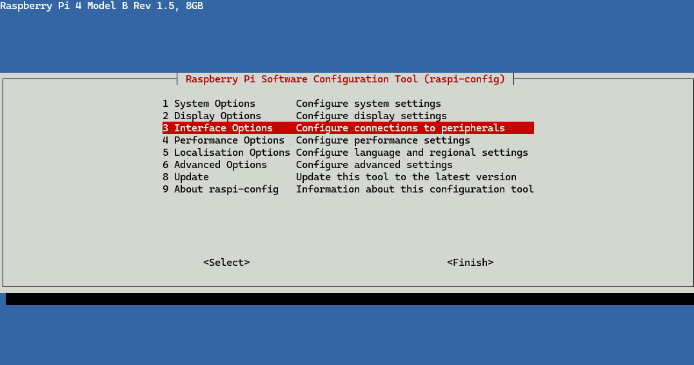
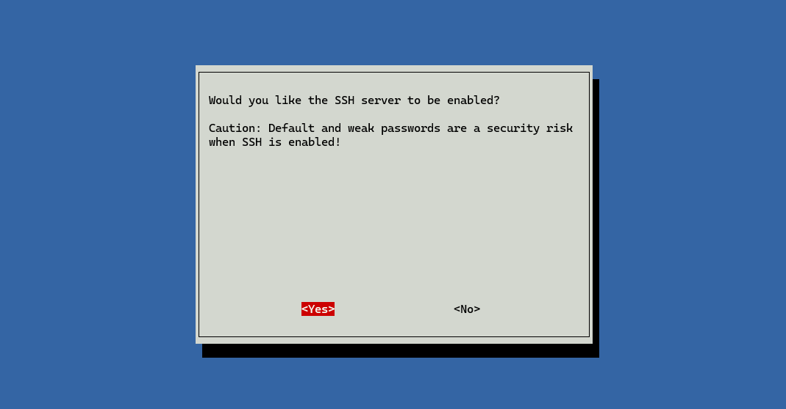
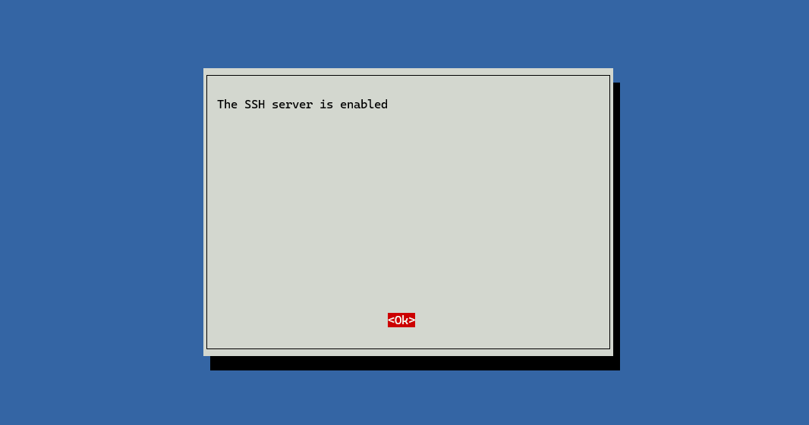
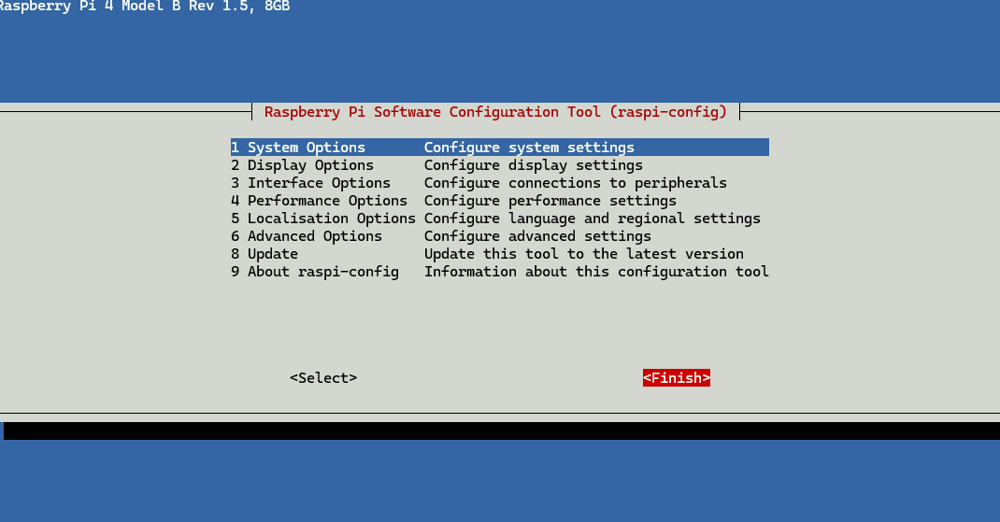
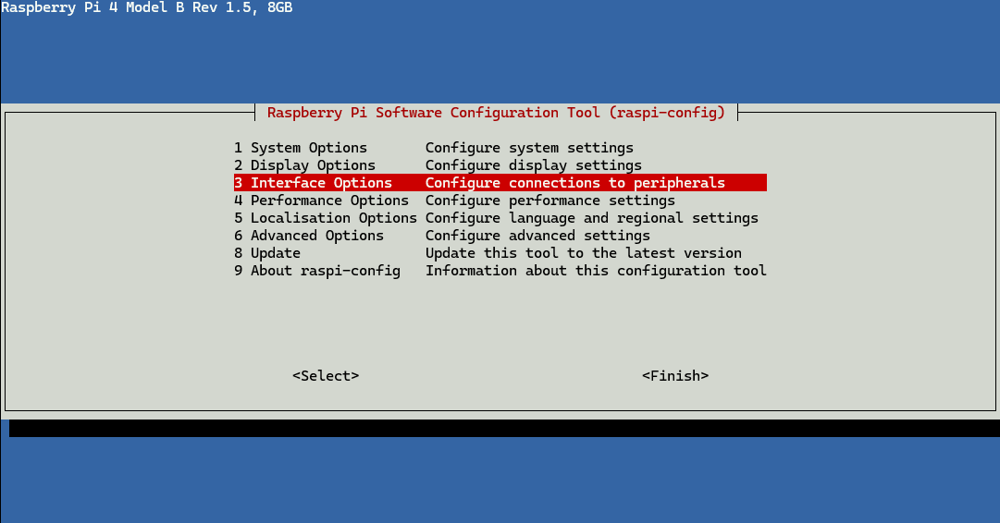
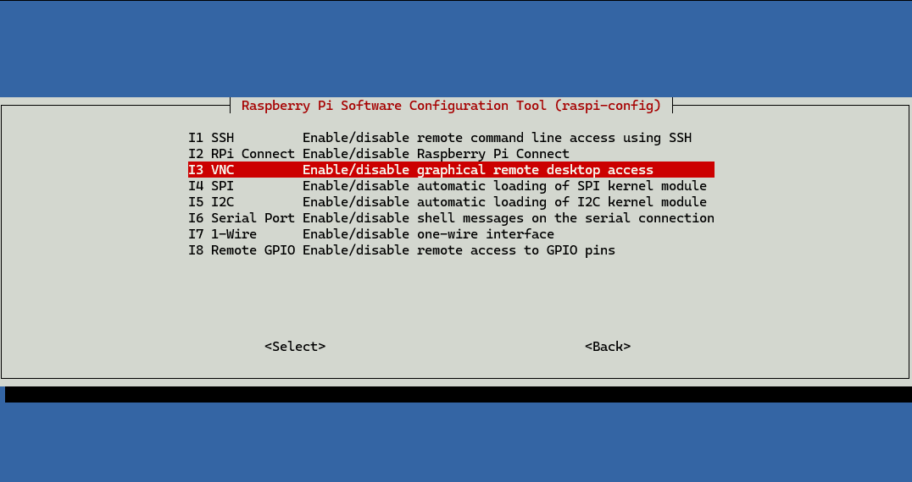
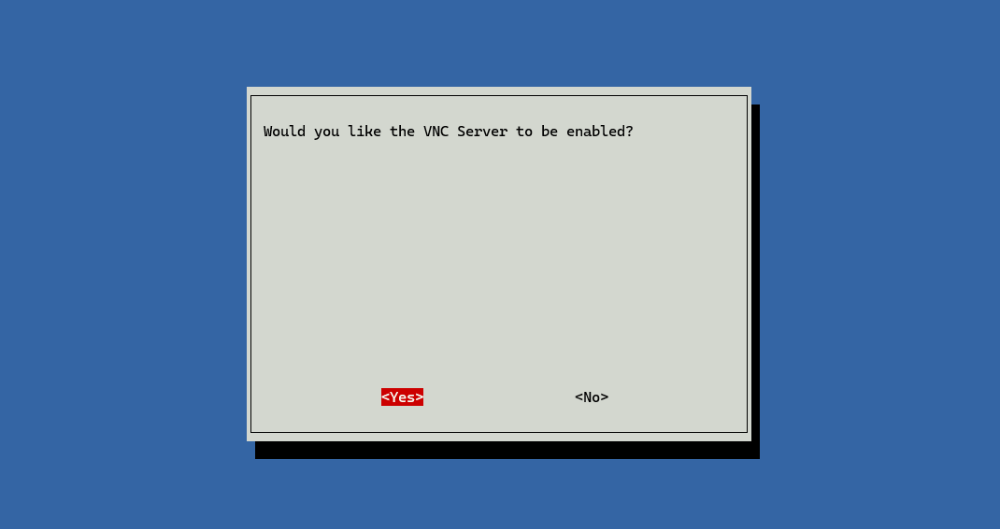
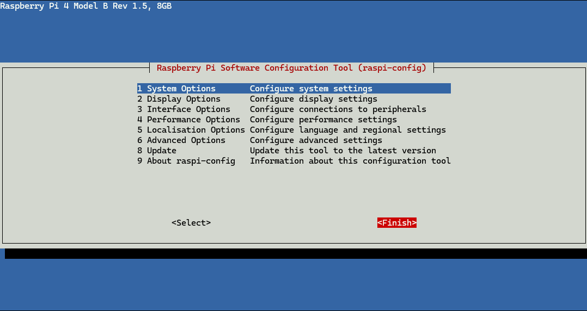
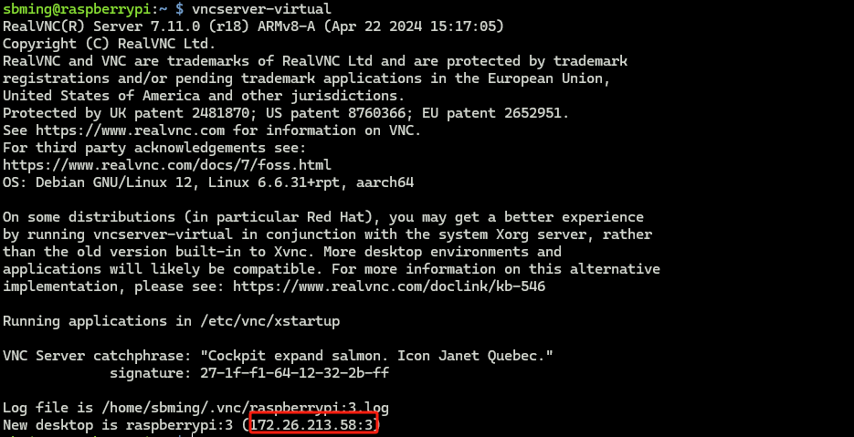

## 树莓派

### 基本配置

需要：树莓派一块、type-C电源供电线（充电器）、鼠标、键盘、屏幕、HDMI连接线（HDMI转microHDMI转接器）。

使用[官方镜像烧录工具](https://www.raspberrypi.com/software/)将镜像烧录到SD卡上。

树莓派插入SD卡，连接鼠标、键盘、屏幕，上电，进行系统引导安装，最后需要联网（WIFI或网线）。

### 远程连接

在树莓派联网的情况下，开启SSH或VNC连接。树莓派可用wifil连接校园网。

```Shell
sudo service ssh start
```

或使用

```
sudo raspi-config
```
进入配置界面










同样使用这种方法开启VNC连接










最后输入指令：

```Shell
vncserver-virtual
```


注意：第一次开启默认端口号是1。

下载[RealVNC Viewer](https://www.realvnc.com/en/connect/download/vnc/)后，在应用中输入树莓派的IP地址和端口号，即可连接远程桌面。

不知道为什么只有第二次开启VNC，连接即端口号为2的时候才可以连接成功，第一次会出现连上但灰屏的情况。

### 安装OpenCV

```Shell
sudo apt-get install python3-opencv
```

## 龙芯教育派

### 基本配置

开源社区：[https://www.loongnix.cn/zh/](https://www.loongnix.cn/zh/)

在[官网](https://www.loongnix.cn/zh/loongnix/)下载镜像，并制作启动盘，参考[博客](https://blog.csdn.net/lurenjia1256/article/details/125116751)。

开发板上电后，如果遇到复位LED灯闪烁、蜂鸣器滴滴响的情况，说明系统一直在重启，有可能是电源供应问题，可以尝试更换电源供应头。

若要烧录镜像，将系统启动盘和键盘同插入**黑色**的USB接口，否则系统会出现响应慢的情况。插入系统启动盘后，系统会自动进入启动界面，用键盘的上下左右键选择启动的项目，按下回车键启动。等待片刻后系统会进入蓝色的启动界面。

注意，需要联网的部分可以暂时跳过，在最后需要你选择安装软件包时，要按**空格**键选择桌面系统等应用。

系统安装完毕后，拔出启动盘，开发板会自动进入桌面系统。

### 授权

创建的默认用户是没有`sudo权限的，需要授权。

```Shell
su - root
usermod -aG sudo username
```

之后的默认用户下即可通过`sudo`命令来获取权限。

### 网络连接

在[开源社区](https://www.loongnix.cn/zh/api/lbrowser/)中下载龙芯浏览器的`.deb`包，这里我选择的时麒麟版，把它拷进U盘里。将U盘插入开发板，将浏览器的安装包放进系统里，在对应目录下输入命令：

```Shell
sudo dpkg -i xxxx.deb
```

安装完成后，接入网线，打开浏览器输入校园网登录的网址，即可联网。

### 换源

由于系统的软件源可能存在一些问题，无法下载任何东西，所以需要更换软件源。

[官方提供的源](https://docs.loongnix.cn/loongnix/lnd-20/loongarch64/Installation_Guide/01.%E5%BF%AB%E9%80%9F%E5%85%A5%E9%97%A8.html)：

```Shell
deb http://pkg.loongnix.cn/loongnix DaoXiangHu-stable main contrib non-free
deb-src http://pkg.loongnix.cn/loongnix DaoXiangHu-stable main contrib non-free
deb http://pkg.loongnix.cn/loongnix Loongnix-kde main contrib non-free
deb-src http://pkg.loongnix.cn/loongnix Loongnix-kde main contrib non-free
```

将`/etc/apt/sources.list`文件中的源替换为上面的源（需要root权限），然后执行下面的命令更新源：

```Shell
sudo apt-get update
```


## 飞腾派

[官方资料包](https://pan.baidu.com/s/1pStiyqohrB3SxHAFFk8R6Q?pwd=dzdv)

### 镜像烧录

使用的镜像是`PhytiumPIOS(v2.0, 4G)`

### 建立连接

参考《飞腾派软件开发手册》，在没有屏幕的情况下使用CH340串口模块，在MobaXterm中建立串口连接。

笔记本电脑开启热点，飞腾派查看WIFI列表：

`nmcli device wifi list`

建立WIFI连接：

`sudo nmcli device wifi connect <SSID> password <密码>`

连接成功：

`Device 'wlan0' successfully activated with 'cbf92833-26d9-4eac-8434-5023c83ce14c'.`

查看已连接：

`nmcli connection show`

切换到root用户：

`sudo su`

接下来配置WIFI自动连接。

`wpa_passphrase <SSID> <密码> > /etc/wpa_supplicant.conf`

并在`/etc/network/interfaces`文件中添加以下内容：

```shell
auto wlan0
iface wlan0 inet dhcp
    wpa-conf /etc/wpa_supplicant.conf
```

重启后`reboot`飞腾派会自动连接配置的热点。


### 基本配置

飞腾派默认安装了python，但是需要安装pip：

`sudo apt-get install python3-pip`

安装opencv：

`sudo apt-get install python3-opencv`

在使用ssh连接的情况下，可使用xvfb跑测opevcv程序：

```shell
sudo apt-get install xvfb
xvfb-run -a python test.py
```

配置XRDP远程桌面，在板端安装：

`sudo apt-get install xrdp -y`

在用户的主目录下建立配置文件：

```shell
touch .xsession
echo xfce4-session > .xsession
```

确认连接信息：

`sudo systemctl status xrdp`

在主机端`WIN+R`输入`mstsc`打开远程桌面，输入板端的IP即可连接。

### 松科AI加速棒

**由于飞腾派上只有一个USB3.0接口，可能无法同时连接摄像头和加速棒，所以可以使用USB3.0拓展坞将其拓展，再将摄像头和加速棒连接到拓展坞上。**

在VMWare中创建Ubuntu18.04虚拟机，参考《模型量化编译文档》，安装Docker。

将编译工具包拷贝到虚拟机中，拉取镜像的时候需要使用root权限。

在拉取镜像的时候可能回遇到以下问题：

`docker: http: server gave HTTP response to HTTPS client`

解决方法：

在`/etc/docker`下创建文件`daemon.json`，添加以下内容：

```json
{
  "insecure-registries": ["IP:PORT"]
}
```

`IP:PORT`是报错信息提供的IP和端口。参考：[https://blog.csdn.net/enter89/article/details/99689609](https://blog.csdn.net/enter89/article/details/99689609)。


在板端部署完DEngine后，常用命令如下：

`sudo sh tools/usbprop.sh 1 -F`：首次执行时配置USB信息

`sudo sh run.sh xxx.py`：运行xxx.py脚本

`sudo sh tools/reboot.sh`：重启TPU


### OpenAMP

[参考教程](https://edu.phytium.com.cn/course/29/task/62/show)


- 内核编译：

环境：WSL(Ubuntu20.04)。按照此目录下的说明文档编译内核：[https://gitee.com/phytium_embedded/phytium-pi-os](https://gitee.com/phytium_embedded/phytium-pi-os)，注意参照README合并支持OpenAMP的配置。


- 从核编译：

首先按照[此文档](https://gitee.com/phytium_embedded/phytium-standalone-sdk/blob/master/doc/reference/usr/install_windos_wsl.md)在WSL(Ubuntu20.04)中安装环境。


接着按照[此文档](https://gitee.com/phytium_embedded/phytium-standalone-sdk/blob/master/example/system/amp/openamp_for_linux/README.md)编译从核。

编译配置：

若要配合[此文档](https://gitee.com/phytium_embedded/phytium-embedded-docs/tree/master/open-amp)下的板端跑测例程，需要修改[此目录](https://gitee.com/phytium_embedded/phytium-standalone-sdk/tree/master/example/system/amp/openamp_for_linux)的`src/slaver_00_example.c`。将函数`rpmsg_endpoint_cb`的内容改为：

```c
static int rpmsg_endpoint_cb(struct rpmsg_endpoint *ept, void *data, size_t len, uint32_t src, void *priv)
{
  (void)priv;
  (void)src;

  /* 请勿直接对data指针对应的内存进行写操作，操作vring中remoteproc发送通道分配的内存，引发错误的问题 */
  memset(temp_data, 0, len);
  memcpy(temp_data, data, len);

  // 发回数据
  rpmsg_send(ept, temp_data, sizeof(temp_data));

  return RPMSG_SUCCESS;
}
```

编译从核：

```shell
make config_phytiumpi_aarch64
make
```

接着参考[此目录](https://gitee.com/phytium_embedded/phytium-embedded-docs/tree/master/open-amp)下的文档将从核部署的飞腾派上。

