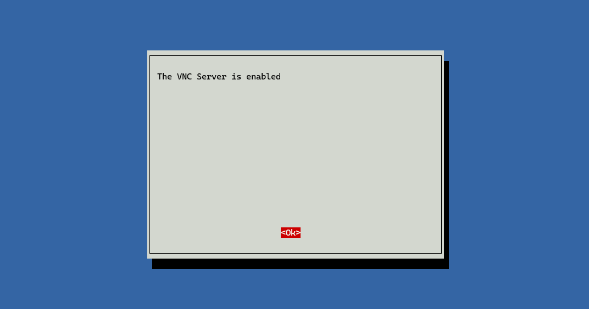

## 树莓派

### 基本配置

需要：树莓派一块、type-C电源供电线（充电器）、鼠标、键盘、屏幕、HDMI连接线（HDMI转microHDMI转接器）。

使用[官方镜像烧录工具](https://www.raspberrypi.com/software/)将镜像烧录到SD卡上。

树莓派插入SD卡，连接鼠标、键盘、屏幕，上电，进行系统引导安装，最后需要联网（WIFI或网线）。

### 远程连接

在树莓派联网的情况下，开启SSH或VNC连接。树莓派可用wifil连接校园网。

```Shell
sudo service ssh start
```

或使用

```
sudo raspi-config
```
进入配置界面


同样使用这种方法开启VNC连接





最后输入指令：

```Shell
vncserver-virtual
```


注意：第一次开启默认端口号是1。

下载[RealVNC Viewer](https://www.realvnc.com/en/connect/download/vnc/)后，在应用中输入树莓派的IP地址和端口号，即可连接远程桌面。

不知道为什么只有第二次开启VNC，连接即端口号为2的时候才可以连接成功，第一次会出现连上但灰屏的情况。

### 安装OpenCV

```Shell
sudo apt-get install python3-opencv
```

## 龙芯教育派

### 基本配置

开源社区：[https://www.loongnix.cn/zh/](https://www.loongnix.cn/zh/)

在[官网](https://www.loongnix.cn/zh/loongnix/)下载镜像，并制作启动盘，参考[博客](https://blog.csdn.net/lurenjia1256/article/details/125116751)。

开发板上电后，如果遇到复位LED灯闪烁、蜂鸣器滴滴响的情况，说明系统一直在重启，有可能是电源供应问题，可以尝试更换电源供应头。

若要烧录镜像，将系统启动盘和键盘同插入**黑色**的USB接口，否则系统会出现响应慢的情况。插入系统启动盘后，系统会自动进入启动界面，用键盘的上下左右键选择启动的项目，按下回车键启动。等待片刻后系统会进入蓝色的启动界面。

注意，需要联网的部分可以暂时跳过，在最后需要你选择安装软件包时，要按**空格**键选择桌面系统等应用。

系统安装完毕后，拔出启动盘，开发板会自动进入桌面系统。

### 授权

创建的默认用户是没有`sudo权限的，需要授权。

```Shell
su - root
usermod -aG sudo username
```

之后的默认用户下即可通过`sudo`命令来获取权限。

### 网络连接

在[开源社区](https://www.loongnix.cn/zh/api/lbrowser/)中下载龙芯浏览器的`.deb`包，这里我选择的时麒麟版，把它拷进U盘里。将U盘插入开发板，将浏览器的安装包放进系统里，在对应目录下输入命令：

```Shell
sudo dpkg -i xxxx.deb
```

安装完成后，接入网线，打开浏览器输入校园网登录的网址，即可联网。

### 换源

由于系统的软件源可能存在一些问题，无法下载任何东西，所以需要更换软件源。

[官方提供的源](https://docs.loongnix.cn/loongnix/lnd-20/loongarch64/Installation_Guide/01.%E5%BF%AB%E9%80%9F%E5%85%A5%E9%97%A8.html)：

```Shell
deb http://pkg.loongnix.cn/loongnix DaoXiangHu-stable main contrib non-free
deb-src http://pkg.loongnix.cn/loongnix DaoXiangHu-stable main contrib non-free
deb http://pkg.loongnix.cn/loongnix Loongnix-kde main contrib non-free
deb-src http://pkg.loongnix.cn/loongnix Loongnix-kde main contrib non-free
```

将`/etc/apt/sources.list`文件中的源替换为上面的源（需要root权限），然后执行下面的命令更新源：

```Shell
sudo apt-get update
```


## 飞腾派

资料汇总 [https://edu.phytium.com.cn/group/1/thread/38](https://edu.phytium.com.cn/group/1/thread/38)